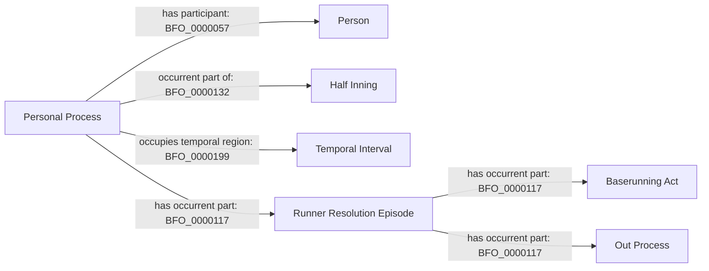

# Existing personal-history pattern

This repeats the accepted C1/C3 structure; it introduces no term or relation.

The reviewed final pitch/count or pickoff evidence selects existing episodes
and their personal whole. The C3 boundary token is a serialization identity,
not a new node or relation. Neither a review nor an associated pitch is made
part of this runner history merely because it supports source reconciliation.
