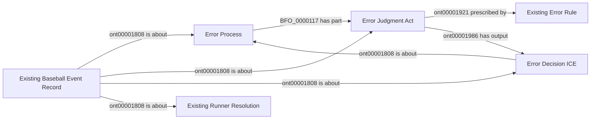
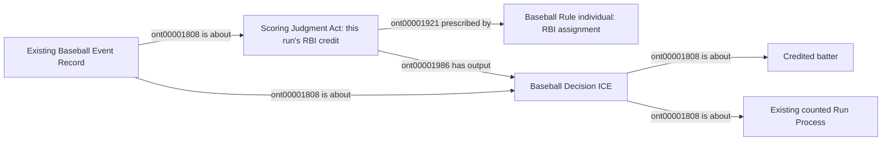

# EG5: secondary errors and separately credited scoring contributions

**Accepted October 9, 2026.** User reply: "Approve EG5 attribution fixes".
The reviewed scope below is accepted, including generic future-game handling,
targeted additive repair through the existing NiFi owner, analytical integration
and the scoped semantic pin updates needed for implementation. No new ontology
classes or object properties, full rebuild, or unrelated RDF replacement.

The following is the proposal text accepted by that decision; its former
review-status and future-tense language are historical. Implementation status
belongs in the active roadmap and metric readiness record.

Status: **under review**, October 8, 2026. No implementation is authorized by
this package. It proposes no classes or object properties and no RDF rebuild.

The existing PA-level Error Process does not describe a separate pickoff or
throwing error during a PA that eventually ends in a flyout, hit or sacrifice.
The current runner graph preserves those advances but lacks their distinct
scoring classification. An unknown channel must not be read as a zero.

## EG5a: separate error classification and its metric boundary

Map an explicitly scored secondary error with the existing Error Process,
Error Judgment Act, Error Decision ICE and Error Rule. Preserve the distinct
actual running act, runner episode and operative resolution. An existing
Baseball Event Record identifies the error classification, judgment, decision
and affected resolution; this does not assert a physical failure or causation.

Identity: one scored error per game, PA, source event and explicitly credited
fielder/error kind. Repeated descriptions of the same credit across runner
rows identify the same error, not several errors. An affected runner row with
an explicit error classification may join a unique reconciled error at that
event. Multiple possible errors, conflicting credits or unresolved corrections
remain unresolved. Do not invent the scorer, an act timestamp or a fielder
when the credit does not identify one.

For the binary Empty Games calculation, an **error-only** advance supplies no
new batting or running positive. Separately supported contact or independent
running contributions remain eligible; an error does not erase a prior known
safe steal. A mixed contact/error row does not by itself establish that the
entire advance was error-only. Speed-conditioned error credit stays deferred.
This explicitly requests the secondary-error running boundary rather than
assuming the earlier batter Error/FC exclusion answered it.

Select only the affected EG1 player-games and these authoritative fields:

| Existing fields | Classification | Use |
| --- | --- | --- |
| Runner `details.eventType`, `movementReason`, exact event index and complete endpoints | Already supplied; coverage debt | Distinguish an explicitly classified error step from a separate safe steal/contact step |
| `credits[].credit`, credited fielder identity and matching event | Already supplied; coverage debt | Identify and deduplicate the particular officially scored error |
| Corrected final play and runner inventory | Already supplied | Reconcile the operative classification and preserve every affected segment |
| Scorer identity, physical failure and precise decision time | Unsupported | Omit; none is inferred from the scoring label |

Witness 822700/54 contains CJ Abrams' pickoff-error advance before Brady House's
flyout. Witness 822709/64 separately records Daylen Lile's steal to second and
throwing-error advance to third before Jorbit Vivas' popout. Their actual
endpoints and credited errors are present in [evidence.json](evidence.json).
The first error cannot manufacture positive batting credit; the second cannot
erase the separately supported steal. Running error-only credit is the explicit
decision requested here.

## EG5b: a supported scoring contribution inside a mixed error play

Witness 822688/67 records Joe Mack's sacrifice fly, Griffin Conine's scoring
resolution with `rbi: true`, and other advances with `rbi: false`. The runner
rows all use `error`; treating that label as either positive credit for all
advances or exclusion of all advances is wrong.

Represent the explicit official RBI credit as an existing Scoring Judgment Act
prescribed by a Baseball Rule individual for RBI assignment, with an existing
Baseball Decision ICE about the particular batter and counted Run Process.
Its Baseball Event Record is about the judgment and decision. Identity is one
operative credit decision per credited batter and counted run. Keep this
separate from the error judgment, actual contact membership and official PA
credit. The scorer's identity and decision timestamp remain absent if unknown.

Require the explicit runner-level RBI flag, reconciled counted run, completed
operative PA result, unambiguous credited batter and matching per-play and
official game RBI totals. These are already supplied fields, not a new source.
Do not select a person merely from an unreconciled final matchup, substitute
chain or prose. Do not turn `rbi: false` into proof of no contribution.

For **Empty Games only**, this explicit credit can establish one positive
batting contribution when the PA result is not excluded by the accepted
Error/FC/interference policy. It supplies no advancement magnitude, contact
parthood assertion, extra independent running credit or replacement for other
metric inputs. It does not credit an actual intermediate advance consumed by
a subsequent out; the counted scoring resolution must be operative.

Rule 9.04 distinguishes RBI credit from accompanying errors, including a
specified third-base scoring case. It does not make every RBI eligible under
our custom metric's exclusions. [2026 Official Baseball Rules](https://mktg.mlbstatic.com/mlb/official-information/2026-official-baseball-rules.pdf).

## Competency questions and bounded execution

- Are two runner descriptions of one credited throwing error two errors? No.
- Does an error label establish a physical failure process or batter causation? No.
- Does an error-only advance create a positive contribution? Proposed answer:
  no; separately supported progress survives and speed-based credit is deferred.
- Can a mixed play retain an explicitly credited scoring contribution?
  Proposed answer: yes, for binary Empty Games under EG5b's exact exclusions.
- Is a missing RBI flag or an RBI total alone enough? No.
- Do these decisions settle PA eligibility, unknown history or review conflicts?
  No. Their independent accepted prerequisites remain.

After named acceptance, record the decision in its own published commit. Add
generic source-owned selectors, existing-vocabulary RML and conformance
constraints. NiFi runs the bounded witness and additive repair through its
existing stages, adding only missing classifications, credit decisions and
dependencies for affected games. Analytical SPARQL reads those promoted facts;
SQL never parses source descriptions or consumes raw scoring totals as values.
Refresh affected derived results only. Preserve unrelated RDF and all raw bytes.
