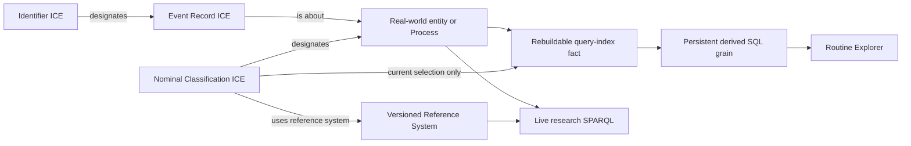

# Source-independent consumer shape

Historical nominal evidence remains queryable in the authoritative graph. The
arrow from nominal evidence to the query index is a current-state selection,
not an OWL equivalence and not a claim that historical classifications vanish.
