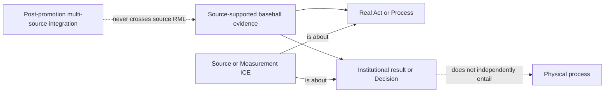

# Accepted source-independent boundaries

```mermaid
flowchart LR
    EVIDENCE[Source-supported baseball evidence]
    ACT[Real Act or Process]
    INSTITUTION[Institutional result or Decision]
    PHYSICAL[Physical process]
    ICE[Source or Measurement ICE]
    MULTI[Post-promotion multi-source integration]

    EVIDENCE --> ACT
    EVIDENCE --> INSTITUTION
    ICE -->|is about| ACT
    ICE -->|is about| INSTITUTION
    INSTITUTION -.->|does not independently entail| PHYSICAL
    MULTI -.->|never crosses source RML| EVIDENCE
```

