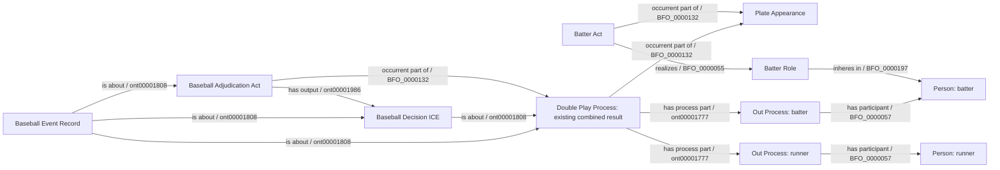

# K1 candidate graph using accepted terms

The proposed additions are the Double Play classification of the existing
result and its two process-part links. Both Out Processes retain their existing
adjudication/decision/record structures and identities. The Mermaid omits those
repeated substructures for readability, not from the required conformance check.
The combined result must include exactly two distinct counted Out Processes
from the same continuous play. No new predicate or Strikeout constituent is
introduced. PA qualification, runner-out ownership, pitch ordering and complete
season reference populations remain distinct requirements.
