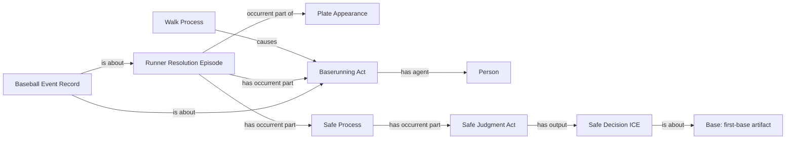

# W2: existing award dependencies (review only)

All classes, relations and identities shown are already accepted. The requested scope is their missing instances for a W1-selected runner row.

The world-side anchor is the accepted runner-award-origin final decision and its existing episode/agent/destination maps. This does not introduce a relation, universal, persistent occupancy or personal-history identity.
