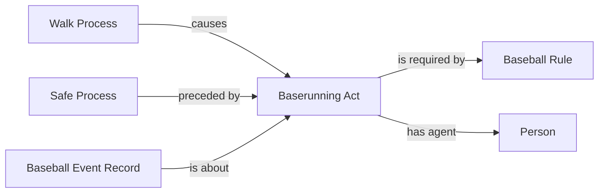

# W5: preserve a walk award after an independently reconciled review

Status: **accepted** by Carter Beau Benson on October 8, 2026. The user replied
**"approve"** to the named D2/W5 request. Record and publish this decision before implementation.

Game 822714 has two excluded Empty Game records. Endy Rodriguez's PA 11 ends
in ball four after a completed stolen-base tag review. Dylan Crews's PA 66
ends in ball four after a completed field review on an earlier pitch. Both
reviews already pass `accounted_runner_history_reviews`, with their operative
counts and runner effects intact. The walk-award selector instead consults
only the narrower count-review handler, refuses both PAs, and omits the
existing award-to-running-act pattern. The EG1 worker consequently reported
`already-present` although these players' contribution ownership was unresolved.

## Proposed decision and exact implementation boundary

Allow the existing walk/intentional-walk award selector to reuse the existing
runner-review reconciler when every review is positively accounted for there.
Keep the final-event, fourth-ball/intentional-award, batter identity, first-base
destination, post-base occupant and force-chain checks. An unfinished, unknown
or contradictory review still withholds the award. Do not infer a prior call,
review mechanism, temporal order or additional review RDF. The existing HBP
terminal-field-review behavior is preserved, not expanded by this package.

This changes only the reviewed-source fallback in `runner_metric_evidence`.
The actual review recognizers and all executable RML triple maps remain
unchanged. There are no ontology changes or new properties.

After acceptance, publish that decision before applying `selection.patch` and
updating the scoped context pins/compatibility entry. NiFi uses the existing
EG1 inventory to retry only still-excluded players with newly selected awards.
Reopen an old success only when the retained input matches this added selection;
do not replay every previously successful case. Add only missing award facts
and existing dependencies, preserve unrelated RDF, complete the existing SHACL
and admission handoff, then refresh affected SQL products. The same selector
handles future ordinary ingestion. This is not a corpus rebuild or wider
acquisition request. Unaffected retained proofs remain reusable.

## Evidence and field selection

`evidence.json` pins the retained response and both exact PA/event identities.
`check.py` compares the current and proposed selector using those unchanged
bytes and checks refusals for incomplete reviews, bad counts and wrong identity.
The first two known matching PAs are witnesses of a generic correction, not
hardcoded game exceptions or a claim that all remaining gaps share this cause.

| Existing field/pattern | Classification | Use |
| --- | --- | --- |
| Walk result, terminal counted ball and safe first-base outcome | Already supplied | Existing award selection |
| PA, event index, runner ID and post-base occupant | Identity/join-only | Exact existing referents |
| Earlier review completion, disposition, counters and runner rows | Already supplied; selector coverage debt | Reuse the already accepted review reconciler |
| Award, running act, safe outcome and rule dependencies | Existing accepted graph pattern | Add only absent facts |
| Missing or contradictory review evidence | Unresolved | Keep the award withheld |

MLB describes first base as the award following four balls.
[MLB walk glossary](https://www.mlb.com/glossary/standard-stats/walk).
Tag plays and possible hit-by-pitch calls are reviewable.
[MLB replay glossary](https://www.mlb.com/glossary/rules/replay-review).
These references support the baseball context; the precise source associations
come from the retained input and accepted reconciler, not a rule-based guess.

## Competency questions

1. May an independently reconciled earlier review erase an otherwise supported
   later walk award? Proposed answer: no; retain the existing award pattern.
2. Does a final walk label alone establish its attribution? No. The terminal
   event and all existing runner/award checks remain required.
3. May this select awards after unfinished, conflicting or unrecognized reviews?
   No. Every review must pass the existing owning reconciler.
4. Does it credit a preceding steal or error advance to the batter? No. Only
   the later award and its independently supported forced advances are selected.
5. May this replace unrelated triples, infer new review facts or widen HBP
   review selection? No.

The source-independent pattern is the accepted W4 award/origin pattern:

The review check is source selection, not a new edge in this pattern.
