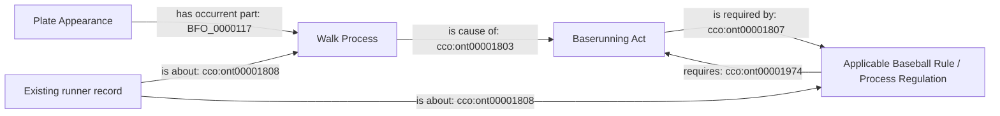

# Existing award pattern for W1

All classes and relations below are already accepted. W1 introduces no terms.
The diagram describes the award's referents independently of provider row counts.

Existing Person agency, persistent Baserunner Role realization, runner resolution,
Safe judgment/decision, base and temporal structures remain their own accepted
patterns. They are prerequisites, not facts supplied by a VB counter sequence.
W1 adds only the missing award/rule links selected by the contract, including
their existing record provenance and rule identifiers.

A preceding mound visit and runner replacement are distinct from this award.
Their source records can establish that no pitch or count change occurred in
the prefix without becoming parts of the Walk Process or realizing its roles.
Four provider counter rows do not establish four judgments or four pitches.
