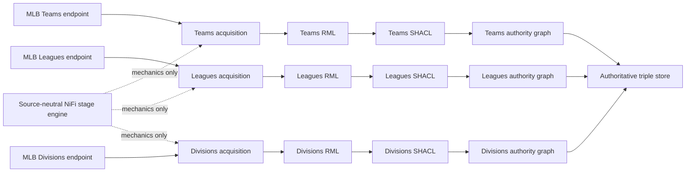

# Source-independent connector boundaries

Solid paths are independently stoppable source lifecycles. The dotted reuse is
limited to source-neutral execution mechanics. No RML, SHACL, transient input,
quarantine, or graph namespace crosses a solid lane boundary.
