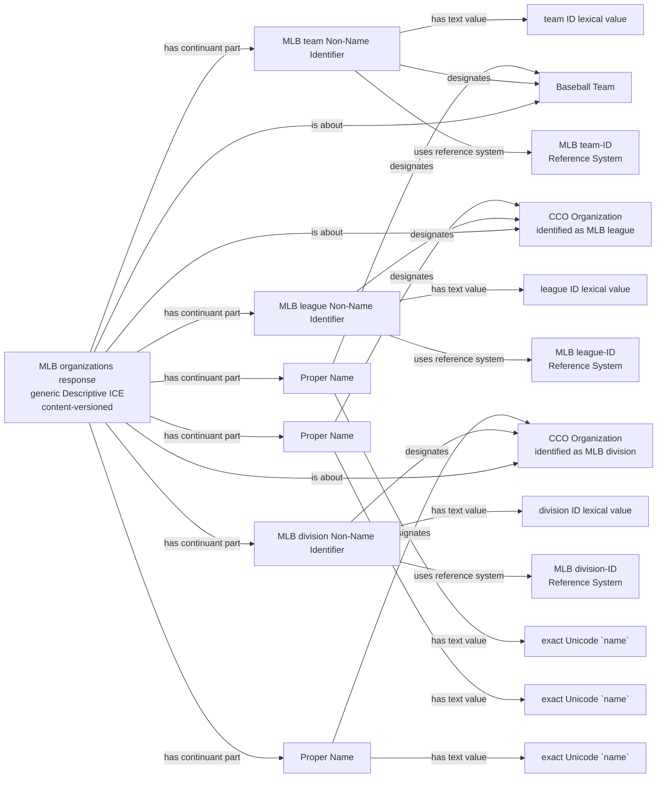
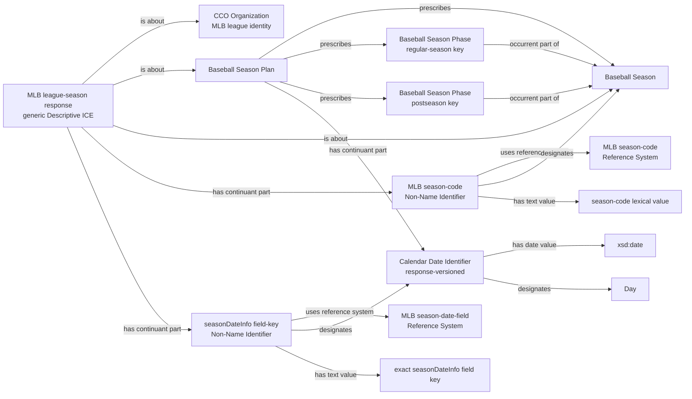
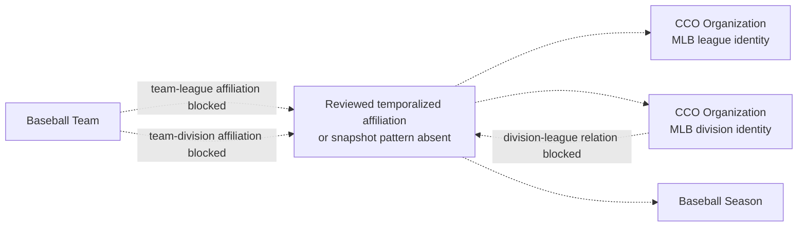
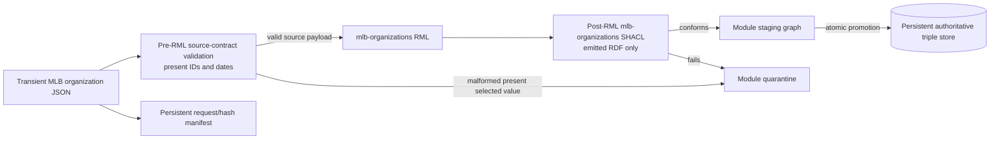

# Source-specific Mermaid review shape

Solid edges are proposed executable RDF after explicit approval. Dashed edges
are blockers and must not appear in RML or authoritative RDF.

## Organization identity, names, and record provenance

A particular response is about only the entities actually present in it; this
union shape does not require every response to contain all three resource
kinds. League and Division are generic Organizations. Their provider kind and
identity are carried by the identifier/reference-system pattern, not by a new
field-shaped ontology class.

## Season, Plan, reviewed Phases, and date evidence

The regular-season or postseason node and its edges exist only when the exact
reviewed start/end pair is valid and non-null. Other date keys still produce
Plan-part Date Identifiers but no Phase. The shape deliberately has no edge
from Day or Date Identifier to Phase: the pinned ontology lacks a reviewed
relation expressing the intended boundary without overclaiming temporal
occupation.

## Explicitly blocked institutional edges

Nesting, a shared season request, or an IRI identity scope does not replace the
missing relation. No solid affiliation edge is authorized.

## Detachable execution boundary

The input gate can see malformed present source values before RML. SHACL can
validate only triples RML emitted; it cannot detect a source value that the
mapping omitted. Null and absent optional values pass input validation and
follow the reviewed no-emission policy.

This lane has no RML or SHACL dependency on `mlb-game`, `mlb-people`,
`mlb-venues`, or `mlb-transactions`. Cross-source equivalence is evaluated by
explicitly scoped SPARQL only after independent promotion.
