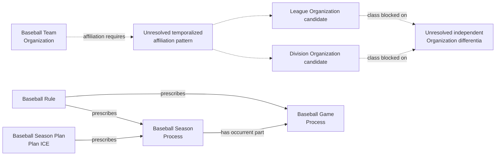
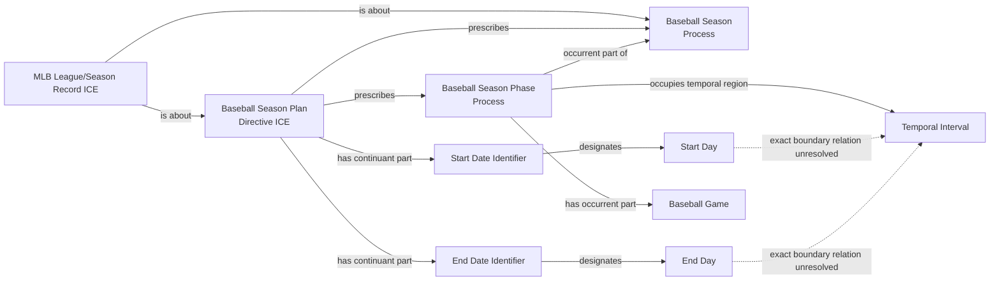
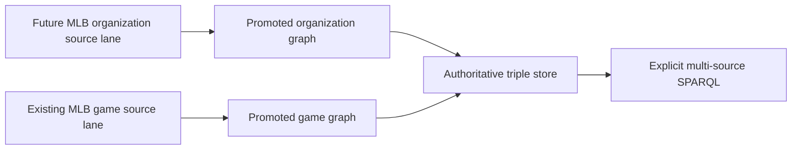

# Source-independent Mermaid

## Processes, planning, and blocked organization semantics

The dashed branches are blockers, not proposed RDF. `BaseballLeague` and
`BaseballDivision` are withheld because a Rule ICE cannot be made a continuant
part of an Organization and the observed nesting does not supply an independent
identity account. The pinned vocabulary's unqualified `is affiliated with`
relation also cannot by itself state which season an affiliation holds during,
and a Mermaid label cannot repair that gap. A later source-specific design must
use accepted Organization and temporalized-affiliation patterns.

No League participation in the Season Process is asserted. A particular Act of
Planning, its Agent, and any Organization participation require evidence of
those Processes; they are not inferred merely because a record nests season
data or because a Plan exists.

## Season plan and phase boundaries

The source-specific implementation must distinguish planned boundaries from
observed first/last games and must not create a phase from a null date.
Prescription by the Season Plan does not classify the Season or Phase as a
Planned Act; intentional Acts occur as parts of the Season's Games.
Date Identifiers designate Days. The dashed boundary links are unresolved and
must not be replaced by an invented `designates boundary of` property.

## Source separation

There is no RML or SHACL edge between the two lanes.
