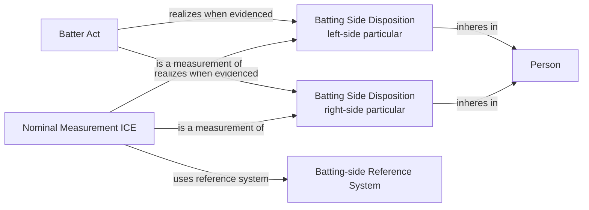

# Source-independent Mermaid

An `L` or `R` observation supports one classified disposition. An `S`
observation supports both particular dispositions. The people source does not
invent a Batter Act; realization edges require event evidence at that grain.
