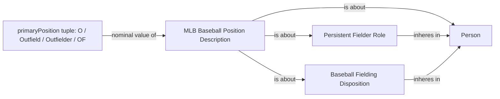

# MLB people source-specific shape

```mermaid
flowchart LR
  O["primaryPosition tuple: O / Outfield / Outfielder / OF"]
  D[MLB Baseball Position Description]
  P[Person]
  R[Persistent Fielder Role]
  F[Baseball Fielding Disposition]

  O -->|nominal value of| D
  D -->|is about| P
  D -->|is about| R
  D -->|is about| F
  R -->|inheres in| P
  F -->|inheres in| P
```

The existing MLB people RML fielder branch realizes this shape. Only the exact
reviewed source tuple table and its SHACL admission need extension.
