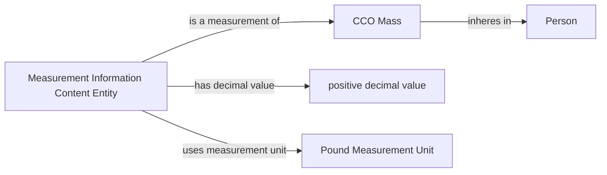

# Source-independent Mermaid

Solid edges use accepted vocabulary. The diagram says nothing about a provider
field or source-specific IRI.

There is intentionally no Measurement Process. The particular measurement
content may change while the Mass Quality continues to inhere in the Person.
