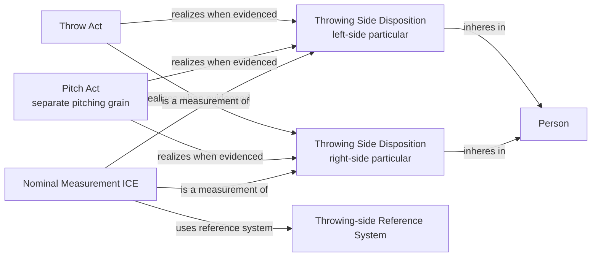

# Source-independent Mermaid

The people source asserts the real disposition and its nominal classification,
but it does not invent a realization event. Ambidextrous evidence supports both
particular dispositions.
