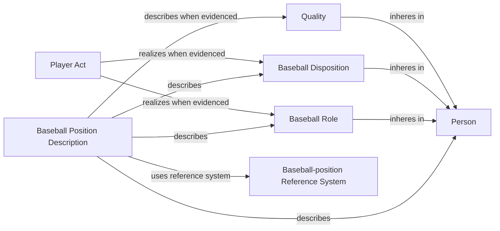

# Source-independent Mermaid

The position description provides an information-level summary of a real
cluster. It does not replace, realize, or collapse the Roles, Dispositions, and
Qualities it describes. The people source does not invent the Player Act.
