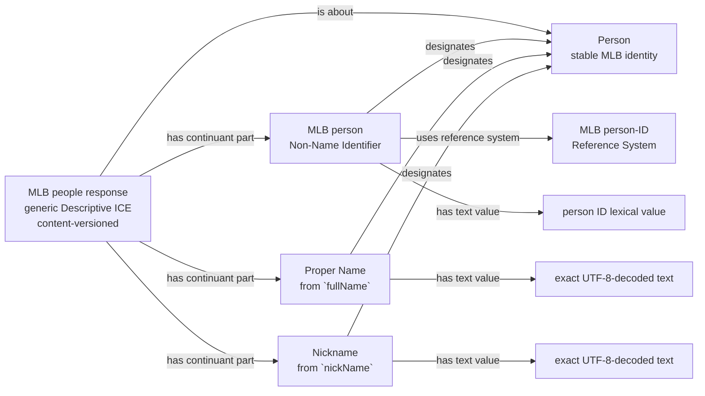
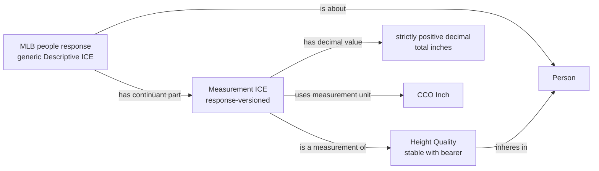
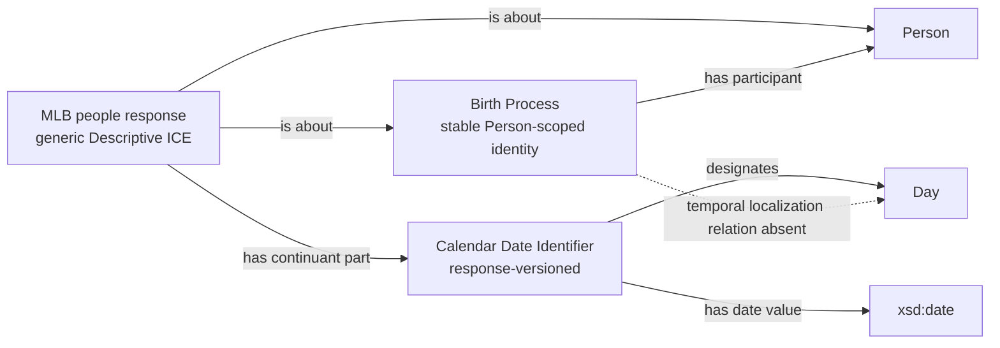
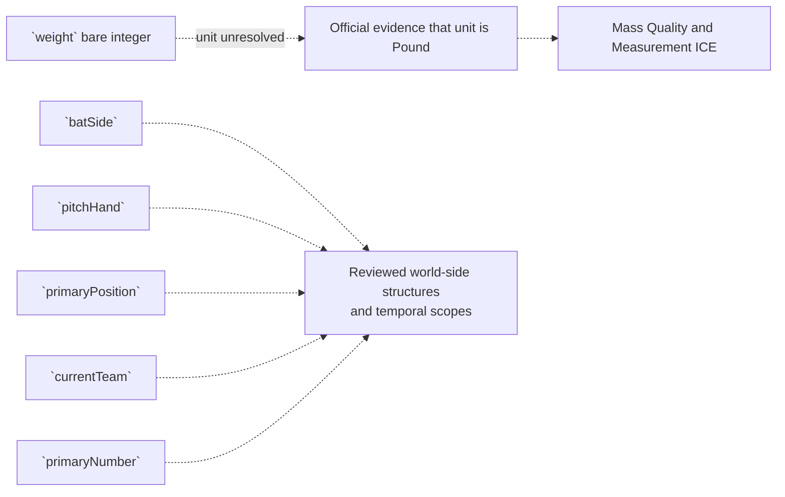
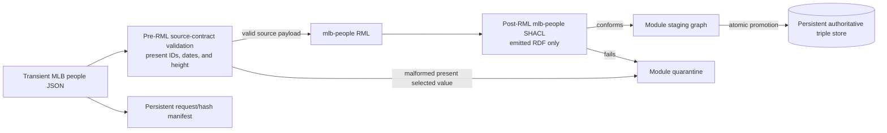

# Source-specific Mermaid review shape

Solid edges are proposed executable RDF after explicit approval. Dashed edges
are blockers and must not appear in executable RML or authoritative RDF.

## Person identity and names

Null name fields emit no Name. The literal is not case-folded, ASCII-folded,
or mojibake-repaired. The proof fixture must preserve `Eugenio Suárez` exactly.

## Height measurement without an invented process

The source string must match the reviewed feet/inches grammar, convert by
`(12 * feet) + inches`, and yield a value greater than zero. There is
intentionally no Measurement Process, instrument, method, agent, or time node.

## Birth and date evidence without false temporal localization

The dashed Birth-to-Day edge is not RDF. The response associates its Date
Identifier evidence with the Birth by being about the Birth and containing the
Date Identifier; it does not claim that the Process occupies the entire Day.

## Explicitly blocked fields

No generic field-shaped ICE is substituted for these missing structures.

## Detachable execution boundary

The input gate can see malformed present source values before RML, including a
height that computes to zero. SHACL can validate only triples RML emitted and
cannot detect a present source value that the mapping omitted. Null and absent
optional values pass input validation and follow the reviewed no-emission
policy.

The lane does not map game participation or game-scoped roles. It has no RML
or SHACL dependency on another source module; canonical identities meet only
after independent promotion.
