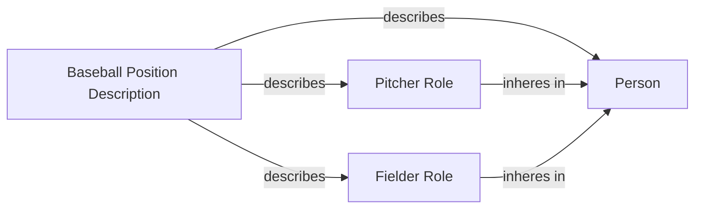

# Source-independent Mermaid

```mermaid
flowchart LR
    DESCRIPTION[Baseball Position Description]
    PERSON[Person]
    PITCHER[Pitcher Role]
    FIELDER[Fielder Role]

    DESCRIPTION -->|describes| PERSON
    DESCRIPTION -->|describes| PITCHER
    DESCRIPTION -->|describes| FIELDER
    PITCHER -->|inheres in| PERSON
    FIELDER -->|inheres in| PERSON
```

The diagram contains no realization edge. The Position Description is an ICE
about the Person and both real Roles; it does not replace any of them.
