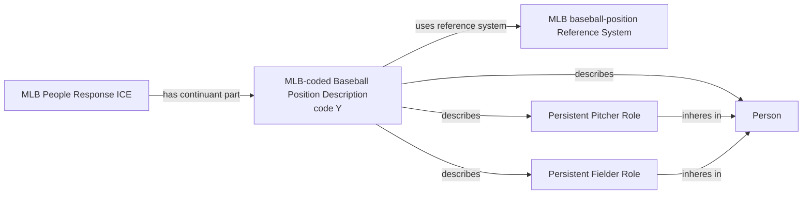

# MLB people source-specific Mermaid

```mermaid
flowchart LR
    RESPONSE[MLB People Response ICE]
    DESCRIPTION[MLB-coded Baseball Position Description\ncode Y]
    SYSTEM[MLB baseball-position Reference System]
    PERSON[Person]
    PITCHER[Persistent Pitcher Role]
    FIELDER[Persistent Fielder Role]

    RESPONSE -->|has continuant part| DESCRIPTION
    DESCRIPTION -->|uses reference system| SYSTEM
    DESCRIPTION -->|describes| PERSON
    DESCRIPTION -->|describes| PITCHER
    DESCRIPTION -->|describes| FIELDER
    PITCHER -->|inheres in| PERSON
    FIELDER -->|inheres in| PERSON
```

The exact provider tuple is a pre-RML gate. The source-specific code remains on
the Position Description; it is not embedded in a new ontology universal.
