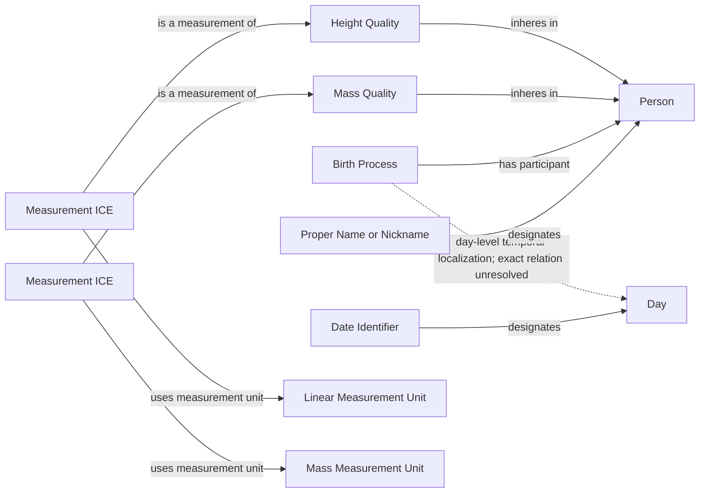
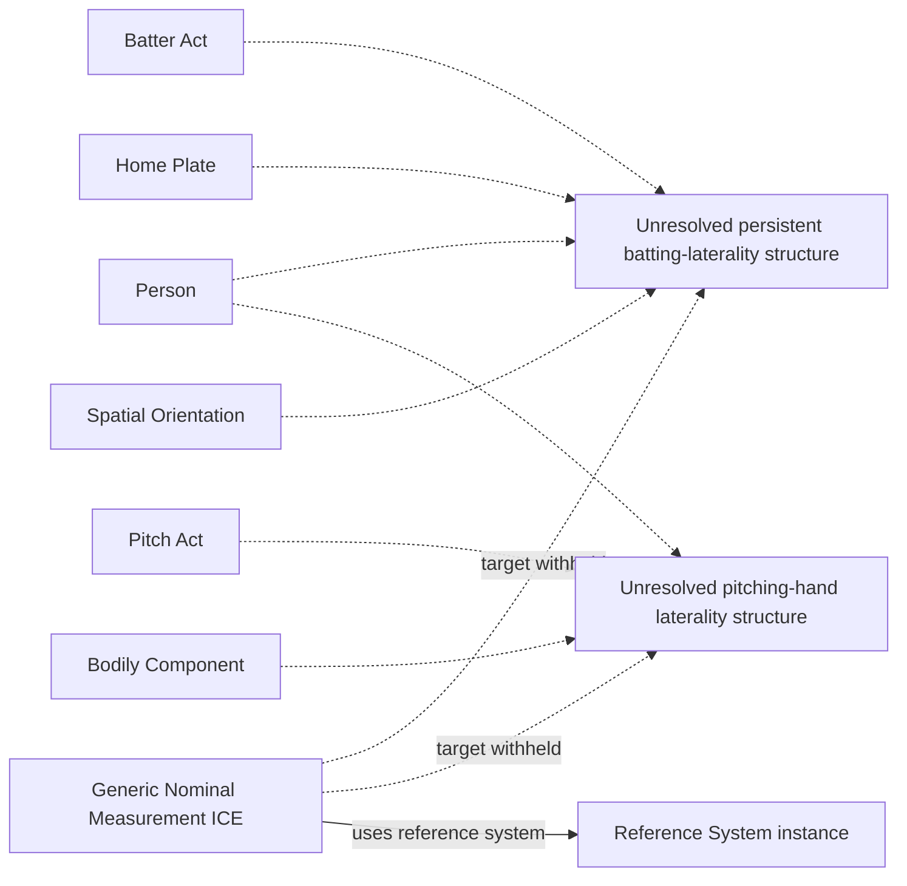
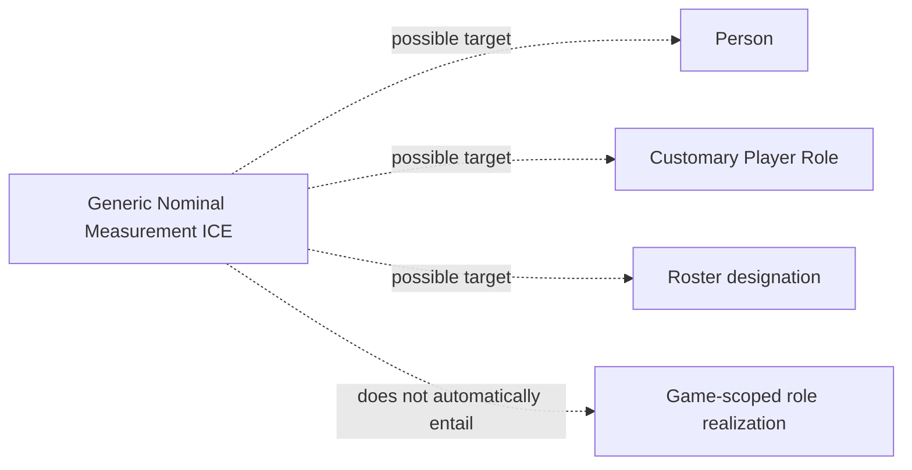
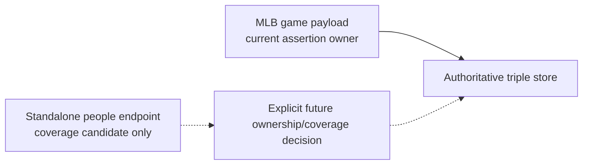

# Source-independent review shapes

## Existing person and measurement pattern

All solid nodes and relations in this shape already exist. The values and units
are directly asserted on the Measurement ICE only if the shared ICE foundation
is accepted.

The dashed Birth-to-Day edge is a blocker. A reported date establishes that
the Birth occurred sometime within the designated Day; it does not establish
that the Birth Process occupied that entire Day. Executable mapping must wait
for an accepted temporal-containment or localization pattern.

## Laterality stops at missing world-side structure

Dashed edges are review questions, not proposed relations or executable RDF.
No field-specific ICE class stands in for either missing structure. The solid
reference-system edge depends on prior acceptance of the ICE-direct foundation.

## Primary-position target remains unresolved

## Source-ownership decision

The dashed people route cannot become a NiFi/RML lane without a new accepted
ownership decision.
