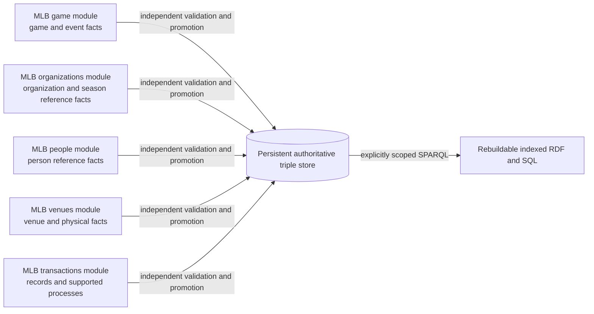

# Accepted source-ownership shape

This diagram assigns fact ownership and integration boundaries. It does not
specify any source-specific RDF triple shape.

Every module has a separate NiFi lane, mapping, source SHACL profile, staging,
quarantine, evidence, and graph namespace. Canonical identities meet only in
the triple store. Shared execution code may orchestrate the same lifecycle but
does not own a source's semantics.
