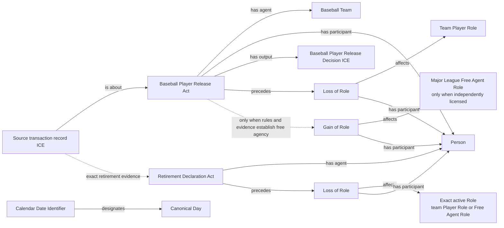

# Source-independent Mermaid

`Baseball Player Release Act` is proposed under `Baseball Roster Status Act`.
It is grounded by the Team's causal agency, its release-decision output, and
the supported downstream Loss of the exact team Player Role. Release does not
automatically establish Major League free agency. Retirement ends only the
exact active Role supported by the evidence; it is not a universal career-wide
loss assertion.

