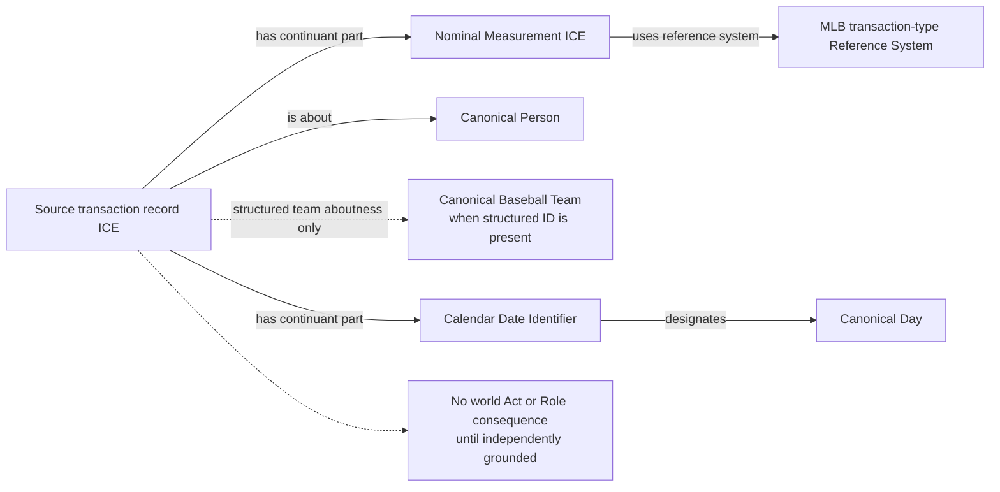

# Source-independent Mermaid

Assigned, Recalled, Optioned, Outrighted, and Selected remain information-only
in the first RML pass. The provider code does not establish a specific Act,
temporary Role, Gain/Loss consequence, or team-stint boundary. This prevents a
source-code taxonomy from becoming the ontology.

