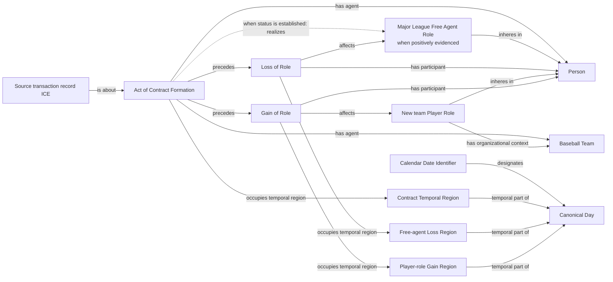

# Source-independent Mermaid

The free-agent branch is emitted only from affirmative Major League free-agent
evidence. Signing never infers that Role merely because an old team Role is
absent. A generic `Signed` row may support contract formation and Gain of a
team Player Role without supporting the free-agent branch.

