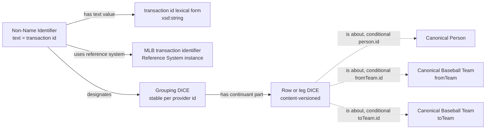
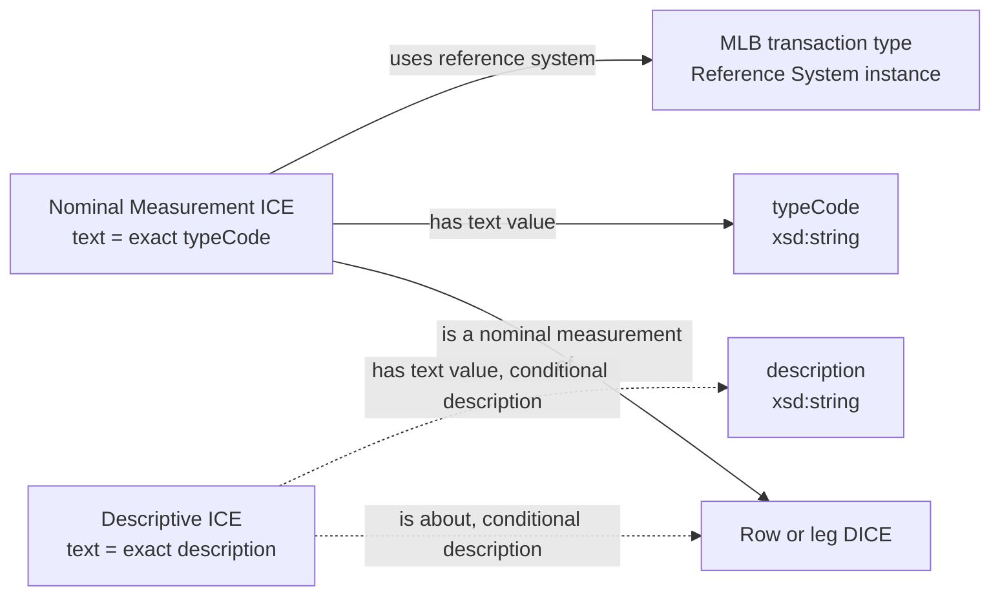
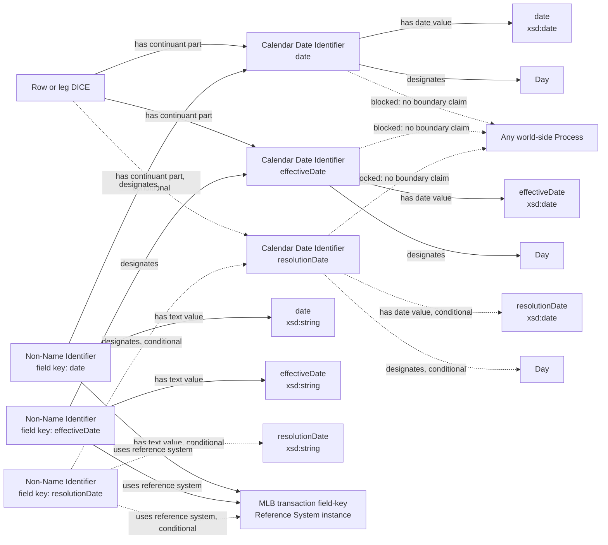
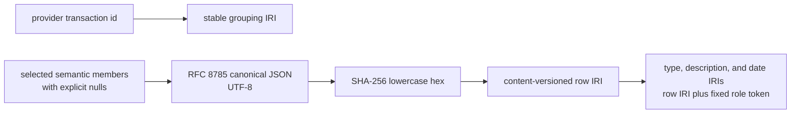
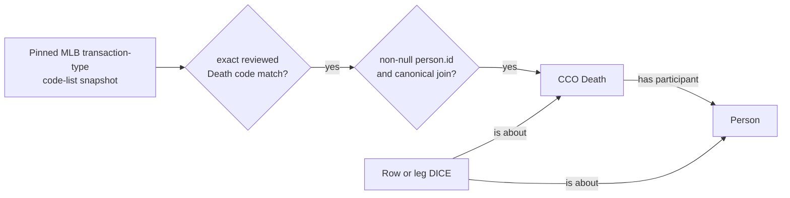
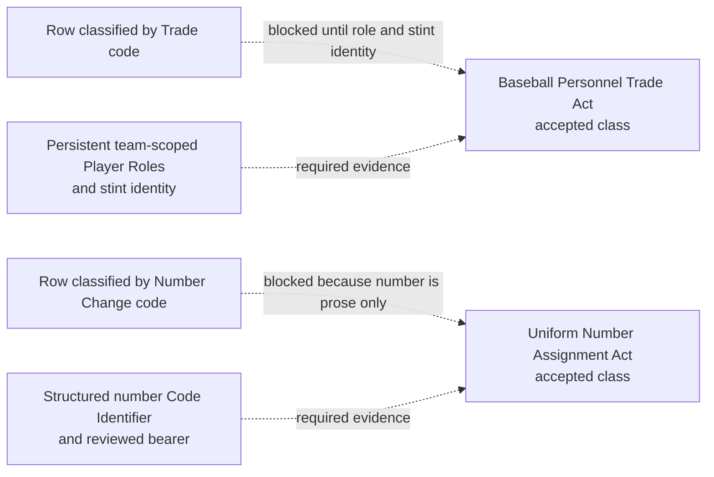
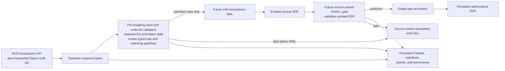

# MLB transactions source-specific Mermaid

These diagrams are the pre-RML review contract. Solid arrows are proposed RDF
assertions. Dotted arrows marked **conditional** are emitted only when their
source value is non-null. Red dashed arrows are explicitly blocked.

## Provider grouping and content-versioned row

The grouping is an information entity, not a world-side act. The optional Team
edges state what the row mentions; they do not state movement, agency,
affiliation, or role change.

## Row classification and description

The pinned MLB transaction-type code list validates the `typeCode` and
`typeDesc` pair. `typeDesc` does not create a second type and does not select a
world-side class.

## Three date fields without invented process boundaries

The provider field keys distinguish the generic date identifiers without new
field-specific classes. None of the three dates is a process boundary or
temporal extent in this release.

## Deterministic identity

The selected members are `id`, `personId`, `fromTeamId`, `toTeamId`, `date`,
`effectiveDate`, `resolutionDate`, `typeCode`, `typeDesc`, and `description`.
No response index, retrieval timestamp, or request window contributes to row
identity.

## The only conditional world-side assertion

If either gate fails, the row remains at the information layer and no Death is
minted. The date identifiers remain unbound to the Death boundary.

## Accepted classes intentionally not instantiated

## Detachable asynchronous lane

NiFi will submit and supervise this lane independently. Normal execution is
asynchronous; a healthy run does not require interactive monitoring. The
pre-mapping gate owns every check that requires the transient JSON or pinned
code list. SHACL validates only emitted RDF and is not expected to discover a
source value that RML omitted; the one-record fixture and source-to-RDF mapping
regression prove that mapping completeness before activation.
