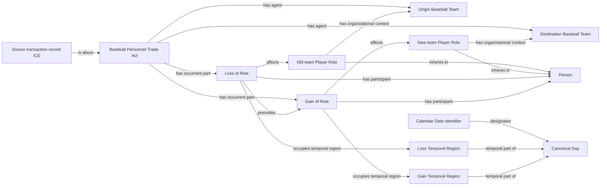

# Source-independent Mermaid

Identical accepted transaction-group identity groups legs into one Trade Act.
Both Teams are agents only when structured direction evidence establishes their
causal participation. The old-role Loss precedes the new-role Gain even when
both are localized only to the same canonical Day.

