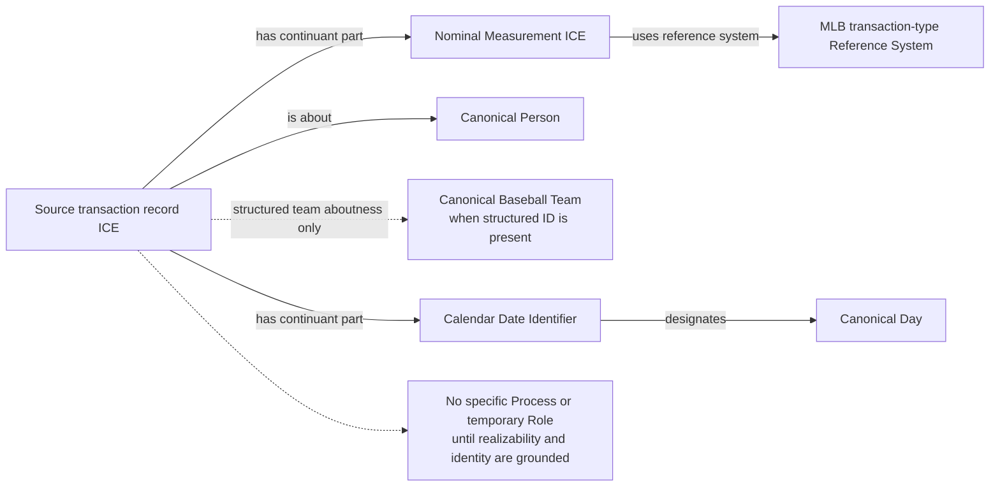

# Source-independent Mermaid

DFA, Waiver, Suspension, Status Change, Acquired, and Obtained remain
information-only in the first RML pass. No DFA Role, Suspended Player Role,
Waiver Status Role, or source-code Act subclass is admitted until an accepted
realization process, identity criterion, and exact institutional consequence
provide an independent semantic anchor.

