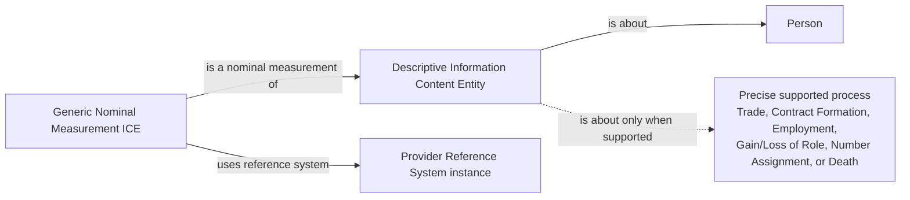
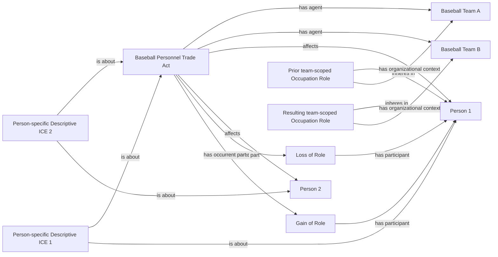
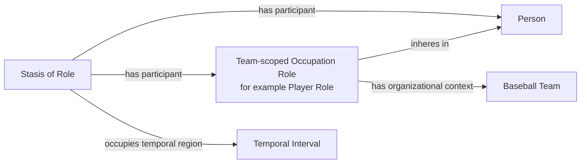
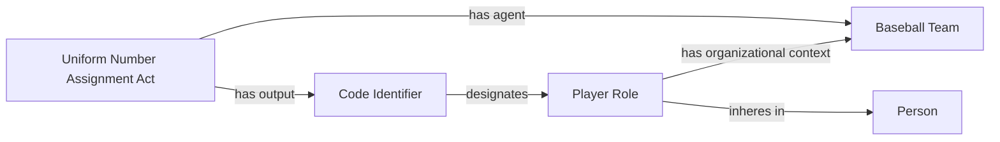
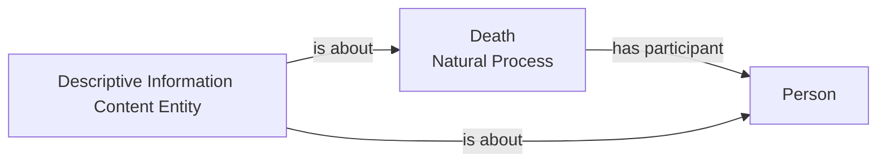

# Source-independent Mermaid

## Record grain versus world processes

An unresolved type may stop at the record/classification layer. It does not
license an anonymous or generic transaction act. The reference-system edge
depends on prior acceptance of the shared ICE-direct-value foundation.

## Multi-person trade

The proposed Trade class is instantiated only when the grouped evidence
supports those precise role changes. A later source-specific model must prove
the same Person and team-scoped Occupation Role identities across the existing
Gain/Loss of Role axioms and temporal boundaries.

## Team membership through occupation role and stasis

The role's organizational context expresses the team-membership fact. The
Stasis of Role supplies temporal persistence; neither structure warrants a
second membership-role class.

## Uniform-number assignment

The Code Identifier designates a team-scoped Player Role, not the Person as an
intrinsic or permanent number bearer.

## Death is not an act of transaction

