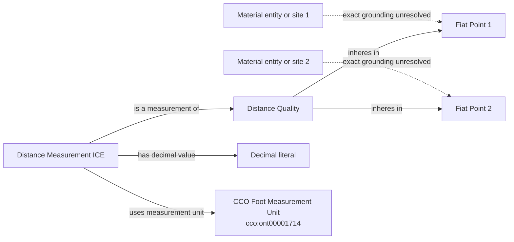

# Accepted unit shape and retained geometry gate

Solid edges are accepted. Dotted edges mark source-specific grounding that
remains unresolved and therefore cannot appear in RML yet.

The shape applies to each of the five MLB field-dimension values. A later
source-specific Mermaid must replace both dotted groundings and state the
configuration and effective-time policy before executable mapping.
