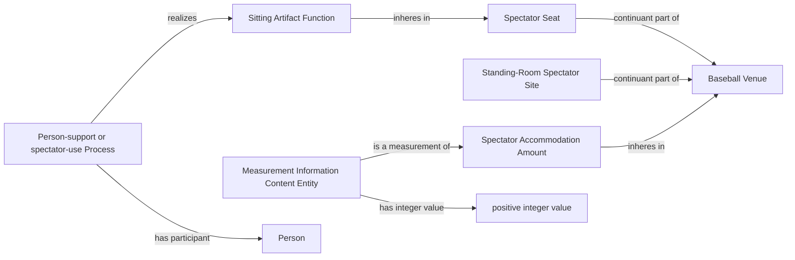

# Source-independent Mermaid

The Venue may be empty while the Amount and Functions continue to exist. The
source measurement does not assert that the use Process is occurring, and it
does not enumerate accommodation parts from the numeric total.
