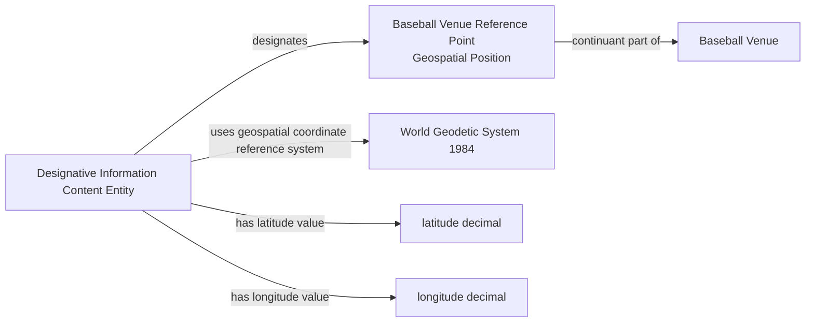

# Source-independent Mermaid

The coordinate ICE identifies and locates a real Fiat Point without becoming
that point or the Venue. Response versioning belongs to the evidence, not the
world-side identity.
