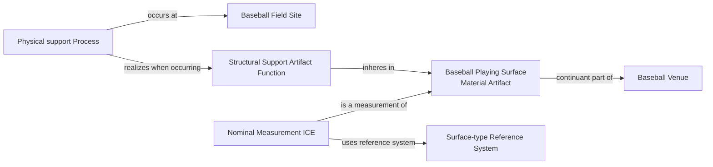

# Source-independent Mermaid

The source does not assert the support Process or a validity interval. The
diagram keeps the material surface, Field Site, Function, realization, and
classification evidence distinct.
