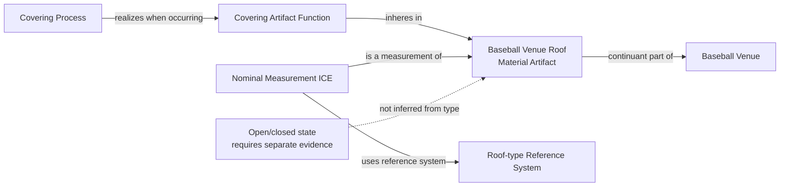

# Source-independent Mermaid

```mermaid
flowchart LR
    VENUE[Baseball Venue]
    ROOF[Baseball Venue Roof<br/>Material Artifact]
    FUNCTION[Covering Artifact Function]
    COVERING[Covering Process]
    CLASS[Nominal Measurement ICE]
    SYSTEM[Roof-type Reference System]
    STATE[Open/closed state<br/>requires separate evidence]

    ROOF -->|continuant part of| VENUE
    FUNCTION -->|inheres in| ROOF
    COVERING -->|realizes when occurring| FUNCTION
    CLASS -->|is a measurement of| ROOF
    CLASS -->|uses reference system| SYSTEM
    STATE -.->|not inferred from type| ROOF
```

An open-air/no-roof classification takes the information-only branch and emits
no `BaseballVenueRoof`. A retractable type does not supply the dashed state.
