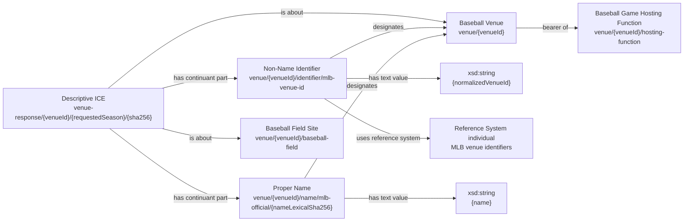
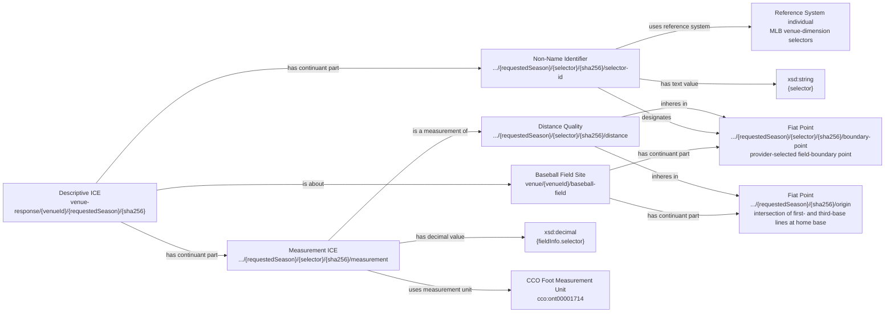
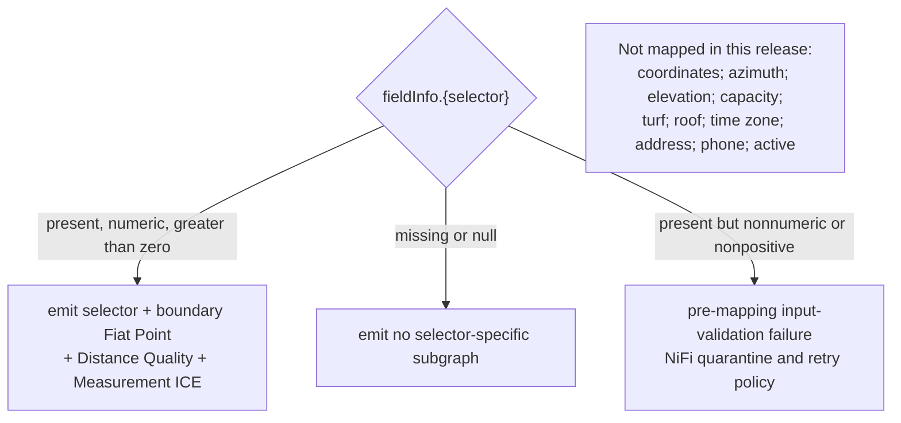
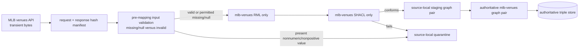

# Source-specific MLB venue RDF shape

This is the required pre-RML review diagram. Every solid edge is a proposed
executable triple using an accepted class or relation. Crossed-out/blocked
items are not mapped. Curly-brace tokens show source-derived identity keys;
`sha256` is the canonical response-content digest recorded by NiFi.

## Venue reference shape

There is intentionally no Venue-to-Field edge. The endpoint response being
about both does not make the Facility identical to, part of, or the location
of the Site. The hosting Function is a stable realizable entity; this response
does not assert a Baseball Game realization.

## One non-null dimension selector

The following subgraph repeats once for each present selector in
`{leftLine, leftCenter, center, rightCenter, rightLine}`.

No Measurement Process, measuring agent, method, uncertainty, fence, wall, or
bearing is inferred.

The origin is shared by all emitted selectors in one response snapshot. The
selected boundary points and their Distance Qualities are kept distinct across
response snapshots unless later reviewed evidence supports equivalence. The
stable Venue, Field Site, hosting Function, venue identifier, and Proper Name
ICE for an unchanged exact lexical name are never response-versioned.

## Identity contract

| Resource | Identity key |
| --- | --- |
| Baseball Venue | normalized MLB `venueId` |
| MLB venue-ID identifier ICE | MLB venue-ID Reference System + normalized `venueId` |
| Baseball Game Hosting Function | canonical Venue IRI + `hosting-function` |
| Baseball Field Site | canonical Venue IRI + reviewed `baseball-field` context token |
| response DICE | normalized `venueId` + requested season + canonical response SHA-256 |
| Proper Name ICE | canonical Venue IRI + reviewed `mlb-official` name kind + SHA-256 of the exact decoded lexical name |
| snapshot origin Fiat Point | normalized `venueId` + requested season + response SHA-256 + `origin` selector |
| selected boundary Fiat Point | normalized `venueId` + requested season + selector + response SHA-256 |
| selector identifier ICE | normalized `venueId` + requested season + selector + response SHA-256 |
| Distance Quality | normalized `venueId` + requested season + selector + response SHA-256 + its two point IRIs |
| Measurement ICE | normalized `venueId` + requested season + selector + response SHA-256 (which covers the decimal content) |
| reference-system individuals | stable project IRIs for MLB venue IDs and MLB venue-dimension selectors |
| unit | existing CCO `cco:ont00001714` |

No array index is ever an identity component. Source spelling and Unicode are
preserved in the Name ICE value. Its digest is computed from the exact decoded
lexical string encoded as UTF-8, without case-folding, accent removal, or other
name normalization; the transient source bytes are never rewritten.

## Missing, invalid, and blocked branches

The requested season is preserved in the NiFi evidence manifest and
response-dependent IRIs only. It does not produce a Baseball Season edge or a
claim that the reported geometry held for the whole season. Source SHACL later
enforces positive decimal values and cardinalities on emitted RDF; pre-mapping
validation is what prevents RML from silently omitting a present bad value.

## Detachable NiFi lifecycle after approval

Raw response bytes are deleted only after successful graph-pair promotion.
Failed inputs remain in the `mlb-venues` quarantine for retry. NiFi submits the
lane asynchronously; no healthy run requires continuous observation.
