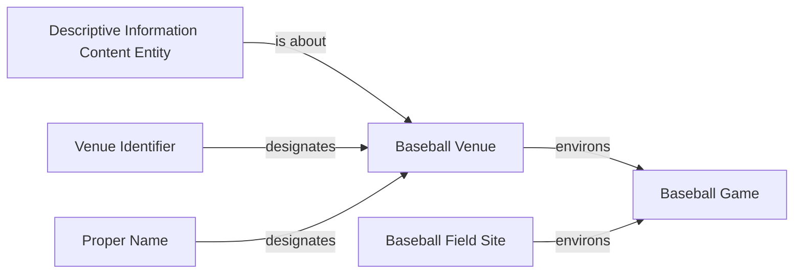
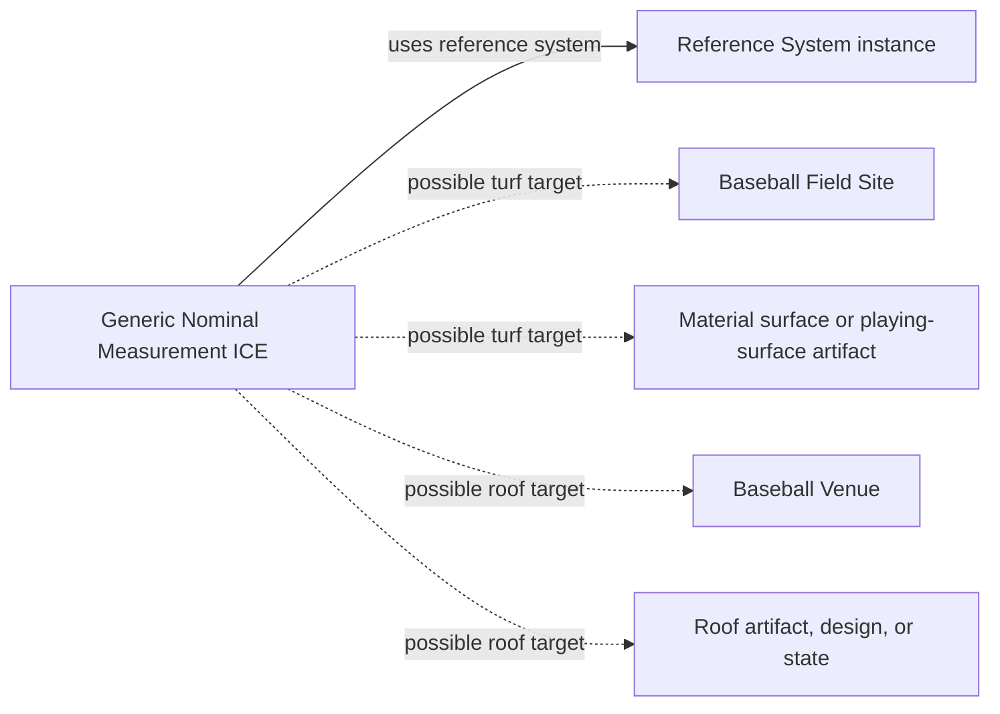
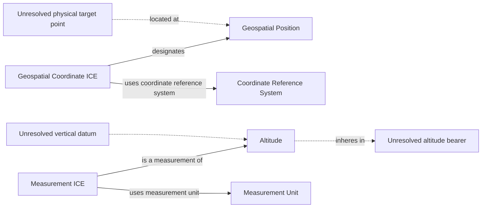
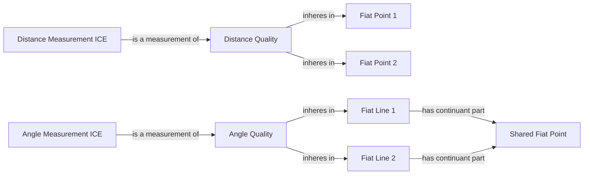
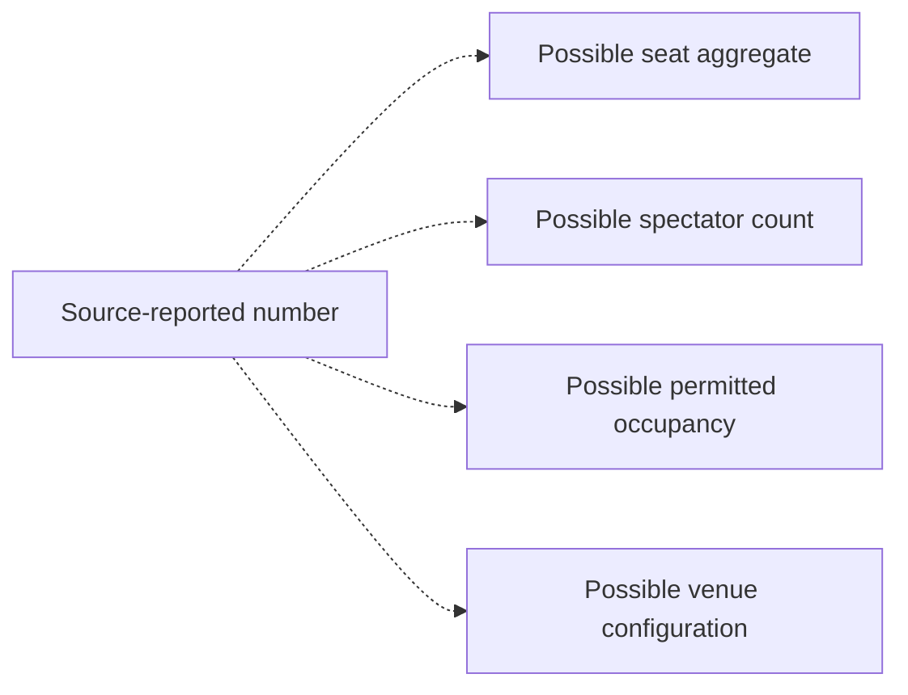
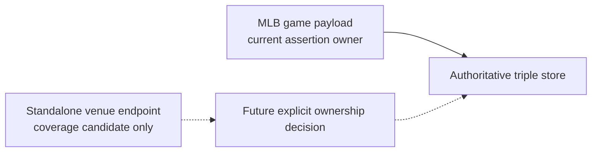

# Source-independent semantic shapes

These shapes contain no source keys. Solid edges use accepted relations;
dashed edges are unresolved questions and never executable claims.

## Venue, field site, and game

The physical Venue, spatial Field Site, and information about them remain
distinct. The accepted ontology currently relates each of the two continuants
to a Baseball Game through `environs`; this proposal does not invent a direct
Venue-to-Field-Site relation.

## Nominal classifications with withheld targets

The solid reference-system edge depends on acceptance of the shared
ICE-direct-value foundation. No provider label creates a surface or roof.

## Geographic position and elevation gaps

Coordinate/reference/unit edges depend on the shared ICE foundation; the
source bindings remain withheld.

## Distance and azimuth gaps

Exact dimension endpoints and azimuth lines are unresolved. `Angle Quality`
and `Distance Quality` depend on the separate geometry proposal.

## Capacity remains an unmodeled question

No Capacity class or Capacity Measurement ICE is proposed.

## Source ownership

