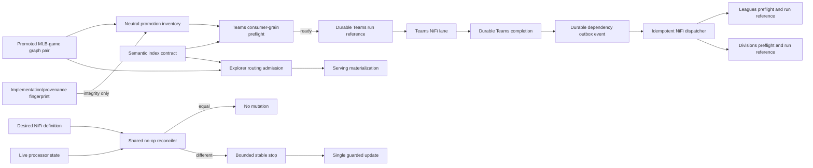

# Accepted control-plane shape

```mermaid
flowchart LR
    GP[Promoted MLB-game graph pair] --> PI[Neutral promotion inventory]
    PI --> TG[Teams consumer-grain preflight]
    TG -->|ready| TO[Durable Teams run reference]
    TO --> TN[Teams NiFi lane]
    TN --> TC[Durable Teams completion]
    TC --> OE[Durable dependency outbox event]
    OE --> DD[Idempotent NiFi dispatcher]
    DD --> LP[Leagues preflight and run reference]
    DD --> DP[Divisions preflight and run reference]

    GP --> ER[Explorer routing admission]
    ER --> SQL[Serving materialization]

    SC[Semantic index contract] --> TG
    SC --> ER
    IP[Implementation/provenance fingerprint] -->|integrity only| PI

    NR[Desired NiFi definition] --> RC[Shared no-op reconciler]
    LS[Live processor state] --> RC
    RC -->|equal| NM[No mutation]
    RC -->|different| ST[Bounded stable stop]
    ST --> UP[Single guarded update]
```
