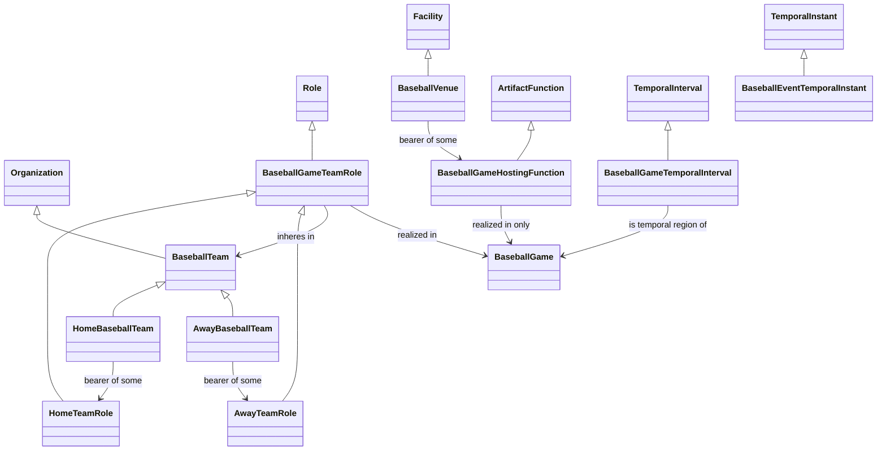
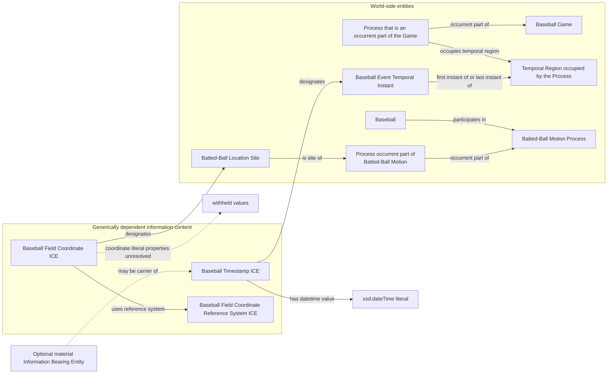
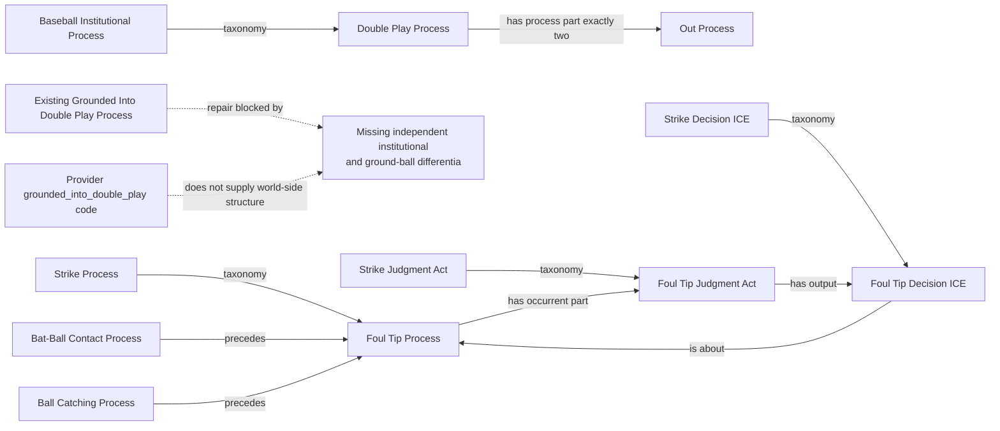

# Source-independent review shapes

These diagrams show candidate ontology structure only. They are not generated
from RML and do not claim that any provider record establishes an instance.
Solid arrows are candidate reviewed relations or taxonomy. Dashed arrows are
explicitly withheld until the named evidence gap is resolved.

## Teams, roles, venue, and time

Home and away classify a team relative to a role instance in a particular
game. They are candidate defined query views over the Role pattern, not
primitive or permanent kinds of Organization. A query must still traverse the
Role's realization to identify the particular Baseball Game.

## Timestamp and coordinate information

The datetime literal and `uses reference system` assertions originate at the
ICE under the separately reviewed direct-value foundation. A material IBE may
carry that content but is not a value-bearing detour. The dashed coordinate
claims are not proposed axioms and must not appear in executable RML before a
separate value-representation, geometry, unit, and source-semantics decision.
One coordinate does not make the Site the location of the entire motion; it
must be tied to the relevant temporal Process part.

## Double play and foul tip

The dashed GIDP branch is not a proposed axiom. The prior Rule/Judgment/Decision
support cluster merely defined four names through one another and has been
removed. `GroundedIntoDoublePlayProcess` remains frozen in the active ontology
until a source-independent institutional criterion and the relevant physical
ground-ball structure can be stated without circularity.

`FoulTipCallICE` is the retained legacy IRI for the node labeled Foul Tip
Decision ICE. A distinct communicated call act may be modeled when evidence
supports it; the decision ICE is not that act. The Grounded-Into-Double-Play
rule, judgment, and decision are proposed supporting classes for the existing
institutional Process class. They do not replace a future physical ground-ball
motion model.

## Challenges, motion, and replay-review acts

```mermaid
flowchart TB
    CHALLENGE[Challenge Act]
    MANAGER[Manager Act]
    PLAYER[Player Act]
    MC[Manager Challenge Act]
    PC[Player Challenge Act]

    CHALLENGE --> MC
    MANAGER --> MC
    CHALLENGE --> PC
    PLAYER --> PC

    BPP[Baseball Physical Process]
    CMOTION[CCO Motion]
    PITCHM[Pitch Ball Motion Process]
    BATTEDM[Batted-Ball Motion Process]
    THROWNM[Thrown-Ball Motion Process]
    BPP --> PITCHM
    CMOTION --> PITCHM
    BPP --> BATTEDM
    CMOTION --> BATTEDM
    BPP --> THROWNM
    CMOTION --> THROWNM

    BALLJ[Ball Judgment Act]
    STRIKEJ[Strike Judgment Act]
    OUTJ[Out Judgment Act]
    SAFEJ[Safe Judgment Act]
    AFFIRM[Affirming Replay Review Act union]
    OVERTURN[Overturning Replay Review Act union]

    BALLJ --> BALLBALL[Ball-Affirming Review]
    STRIKEJ --> STRIKESTRIKE[Strike-Affirming Review]
    OUTJ --> OUTOUT[Out-Affirming Review]
    SAFEJ --> SAFESAFE[Safe-Affirming Review]
    STRIKEJ --> BALLSTRIKE[Ball-to-Strike Review]
    BALLJ --> STRIKEBALL[Strike-to-Ball Review]
    SAFEJ --> OUTSAFE[Out-to-Safe Review]
    OUTJ --> SAFEOUT[Safe-to-Out Review]

    BALLBALL --> AFFIRM
    STRIKESTRIKE --> AFFIRM
    OUTOUT --> AFFIRM
    SAFESAFE --> AFFIRM
    BALLSTRIKE --> OVERTURN
    STRIKEBALL --> OVERTURN
    OUTSAFE --> OVERTURN
    SAFEOUT --> OVERTURN
```

The solid arrows from two genera into challenge and motion leaves represent
candidate intersection axioms, not multiple direct named `rdfs:subClassOf`
parents. The replay leaf's direct parent is its final judgment kind; union
axioms infer the affirming or overturning group.
