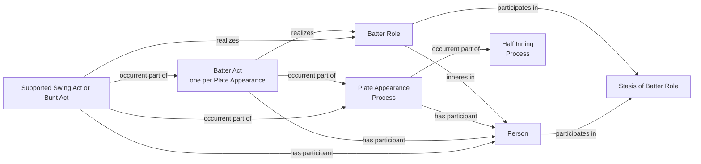

# Source-independent Plate Appearance and Batter Role shape

Identity and cardinality decisions:

- `BatterRole`: one role IRI per Person across that Person's career;
- `PlateAppearance`: one Process IRI per game and source `atBatIndex`;
- each Plate Appearance has exactly one generic Batter Act whose participant is
  the batter Person and which realizes the Batter Role inhering in that Person;
- the Plate Appearance does not itself need a duplicate realization edge;
- supported Swing and Bunt Acts may additionally realize the same Role; and
- a Stasis of Batter Role expresses persistence only.

Forbidden substitute:

A reviewed Stasis may represent persistence without relevant change during an
evidenced interval. It is never used as the realization Process. The generic
Batter Act is that Process in the common Plate Appearance pattern.
