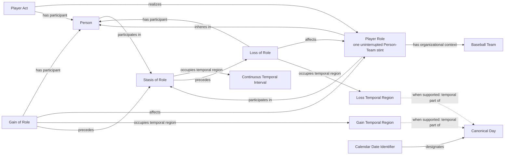

# Source-independent Mermaid

Status: **under review - design only**

The dotted temporal-part edges are guarded assertions, not new properties.
They are emitted only when the owning source supplies Day-level boundary
evidence. A left-censored history may begin with Role and Stasis without an
invented Gain; an open history has no invented Loss. Missing observations do
not end the stint. Leaving and later returning to the same Team creates a new
Role, Stasis, and interval. Stasis never realizes the Role.

