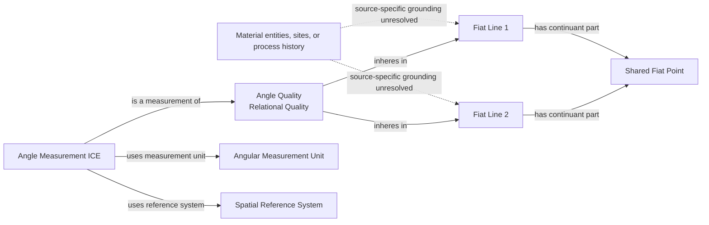
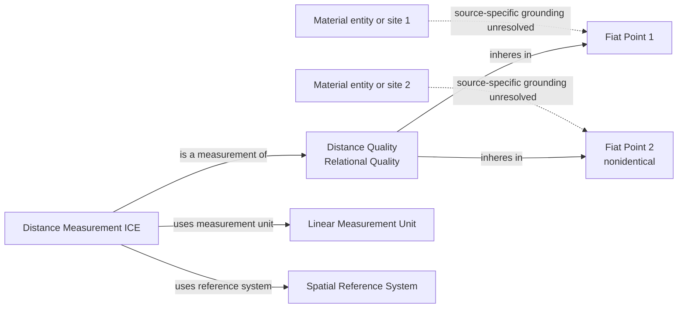
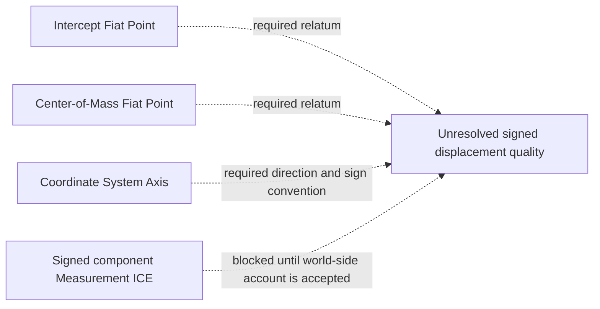

# Source-independent Mermaid

## Angle Quality

The dotted grounding edges are deliberately unresolved and do not propose an
object property. A source-specific design must replace them with accepted
relations supported by the relevant material geometry. Unit and reference
system edges depend on prior acceptance of `ice-direct-values-and-units`.

## Distance Quality

## Explicitly unresolved directed component

