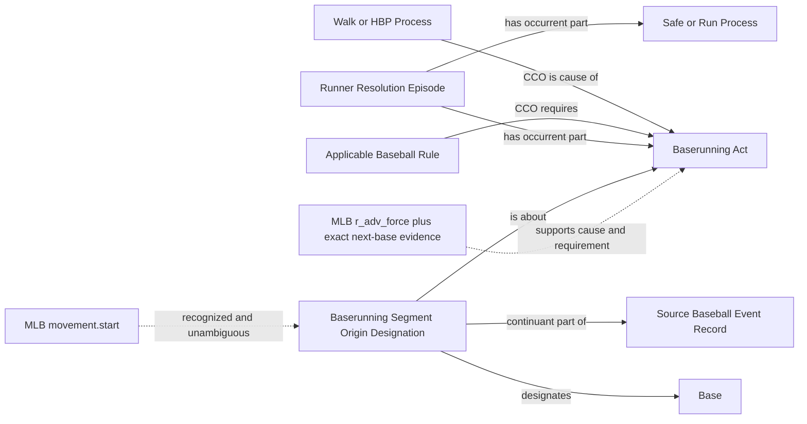

# Final award and movement-origin decision

The user supplied the attached FINAL DECISION FOR THE TWO REMAINING METRIC
GAPS on 2026-09-09 as the requested work. `user-decision.md` preserves the
instruction. It supersedes the award-directive and origin-boundary portions
of `runner-structural-correction`; episode and safe-decision patterns remain.
No new object properties or index predicates will be introduced.

## Competency questions and accepted answers

- Award source: Walk/HBP causes the particular act; the applicable Baseball
  Rule requires the act. Remove BaseAwardDirectiveICE and all dependencies.
- Existing forced runners: require explicit positive force evidence and exactly
  the next-base movement in the same event chain, with operative destination.
- Segment origin: a BaserunningSegmentOriginDesignation, a CCO Designative ICE,
  is about one act and designates one Base. Identity is the origin designation
  in that source runner-row record; it does not change act or role identity.
- Use movement.start, not originBase. A difference between them is not an error:
  two sequential segments can share originBase but have different starts.
- Batter metric trajectories begin at HOME=0, from PA batter identity. Do not
  assert Home as an RDF movement origin or mint a stasis.
- Existing runners prefer the act's designation; PA-start fallback requires
  positive evidence that this act begins from that state and that no same-runner
  movement intervenes. No continuity or ordering is inferred from missing rows.

## Existing source evidence and field selection

| Evidence | Selection | Contract |
| --- | --- | --- |
| PA result, runner identity and row key | identity/join-only; already supplied | Reuse existing act/resolution/episode identities |
| movement.start | already supplied, mapping coverage | Recognized 1B/2B/3B only, unambiguous row/act; never infer stasis |
| movement.originBase | already supplied | Preserve raw bytes; never substitute for start |
| details.movementReason = r_adv_force | genuinely additional assertion from existing field | Positive force evidence, never inferred from bases occupied |
| movement.end and completed result | already supplied | Safe Decision destination or counted Run agrees with required next base |
| details.playIndex and event index | identity/join-only | Same unique terminal award event, no mixed same-runner segment |
| operative replay | unresolved for reviewed PAs | Initial conservative selection withholds reviewed PAs rather than guessing the operative state |
| PA-start no-intervening-movement evidence | unresolved source coverage | Conditional metric fallback implemented; current source does not manufacture completeness proof |

Real evidence: game 566279 PA27 carries r_adv_force for 1B to 2B.
Game 823016 PA39 has HBP forces from 1B/2B; PA40 has a bases-loaded walk
with all three r_adv_force next-base rows and the batter's first-base arrival.
The source files remain unchanged under data/raw/.

Applicable rule individuals reuse BaseballRule (CCO Process Regulation), with
separate batter walk, batter HBP and forced-advance provisions. Edition identity
is supplied by the source season, initially the verified 2019 and 2026 editions;
other editions withhold only this rule-dependent assertion until verified.
Rule provisions are parts of the edition's Prescriptive ICE and have explicit
Code Identifiers. This adds individuals, not rule subclasses or properties.

Primary references: [2019 OBR](https://content.mlb.com/documents/2/2/4/305750224/2019_Official_Baseball_Rules_FINAL_.pdf)
and [2026 OBR](https://mktg.mlbstatic.com/mlb/official-information/2026-official-baseball-rules.pdf),
5.05(b)(1), 5.05(b)(2), and 5.06(b)(3)(B).

## Source-independent and source-specific reviewed shape

Implementation includes source RML/SHACL, graph queries, metric origin policy,
positive/negative fixtures, updated gap records and matching protected pins.
The unrelated metric completeness gates and enabled NiFi topology remain intact.
