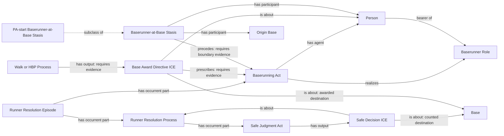
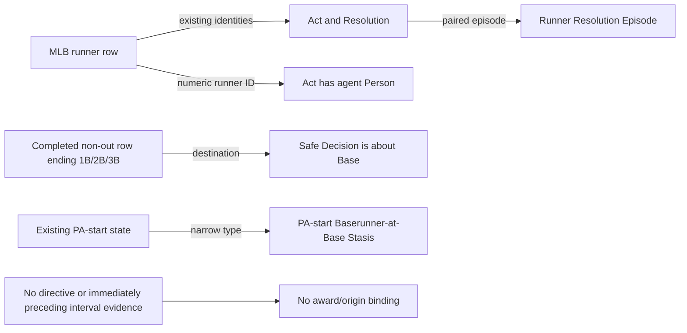

# Runner structural correction

On 2026-09-09 Carter Beau Benson directed: “I want you to remove and fix in
accordance with what I sent you”. This accepts the structural replacement in
the attached text, following his explicit correction that natural-language
metric answers were not permission to create object properties.

This decision supersedes the object-property portions of
`mlb-game-resolution-award-links` and `mlb-game-baserunning-origin`. Remove
all four local predicates and their executable dependencies. Introduce no
object properties, including index predicates. Preserve contact-play parthood,
metric arithmetic, raw evidence, existing promoted graphs, and ingestion schedule.

## Competency questions and bounded answers

1. Which runner is resolved? A Runner Resolution Episode contains one particular
   Baserunning Act and its one Runner Resolution Process. The act has one Person
   as agent and realizes that person's persistent Baserunner Role. Episode identity
   is this act/resolution pair, not a whole plate appearance or a source record.
2. At which Base is the runner counted safe? The episode's Safe Process contains
   a Safe Judgment Act whose Safe Decision ICE is about that process and the
   destination Base. In this narrowly scoped decision-content contract, its sole
   Base referent is the counted safe destination. Generic aboutness elsewhere
   does not carry that interpretation.
3. Which award prescribed the completed advance? Walk/HBP output a Base Award
   Directive ICE, about the awarded Person and destination Base, prescribing
   that person's particular act in the episode. This is prescription, not ICE
   realization. Declare the reviewed pattern, but do not produce directive
   instances from the old completion shortcut: the current selection does not
   independently establish directive content/prescription.
4. Where did an act originate? Generalize Baserunner-at-Base Stasis and retain
   the current PA-start state as its named subclass. Only an evidenced same-runner
   stasis ending at the act's beginning supports immediate origin. Mere
   precedence, missing events, and `movement.start` do not prove persistence.
   Current MLB context does not supply those interval boundaries; leave origin
   unbound. Stasis has participants, never agents or role realizations.

## Source evidence and selection inventory

The existing MLB live-feed `runners` row already supplies runner identity,
movement classification, destination, and the record grain used for the act,
resolution, judgment and decision. Reuse those identities; no new acquisition.

| Source field / evidence | Selection | Scope |
| --- | --- | --- |
| runner ID, PA index, runner row index | identity/join-only | Reuse act and resolution pair; require numeric runner and boolean isOut |
| movement.isOut/start/end | already supplied | Existing resolution-kind branches; no new physical-arrival inference |
| completed PA and non-out end 1B/2B/3B | already supplied | Safe Decision destination aboutness and explicit Base code |
| movement.start/originBase | unresolved | Does not prove stasis persistence or its ending boundary |
| walk/HBP result and forced end-state rows | unresolved | Completion alone does not establish a particular directive prescribing the act |
| PA-start context and interval | already supplied | Preserve identity, source boundary and existing instances in the narrower subclass |
| contact-play containment | deterministically derivable, separately accepted | Preserve existing conservative selection |

## Source-independent structure

## Source-specific realization

The decision authorizes the necessary ontology, overlay, context, source RML,
SHACL, queries, tests, generated inventory and correction-specific freeze pins.
It does not ratify unrelated semantic debt or authorize speculative source
coverage. NiFi remains the owner of subsequent corpus proof and promotion.
