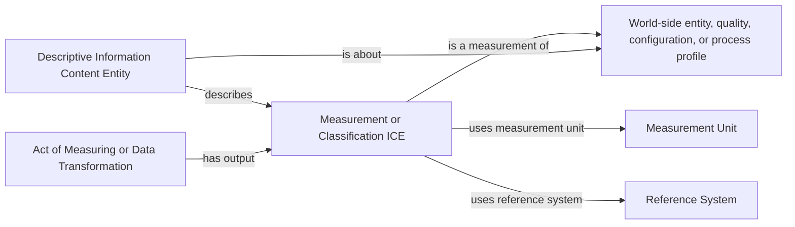
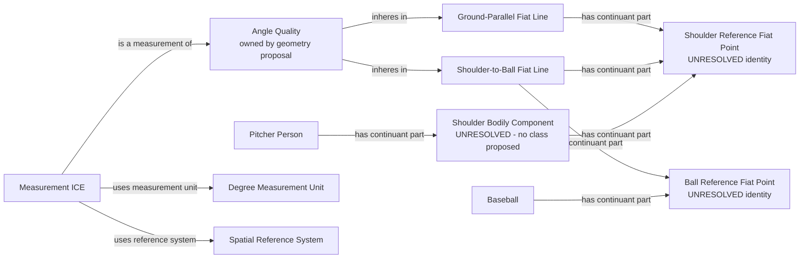
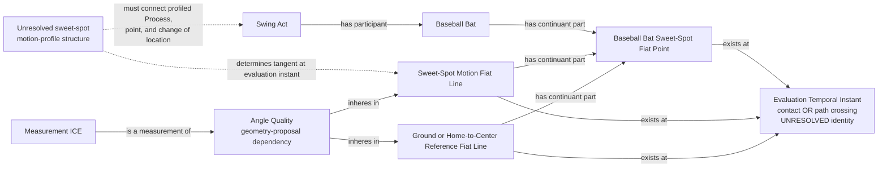
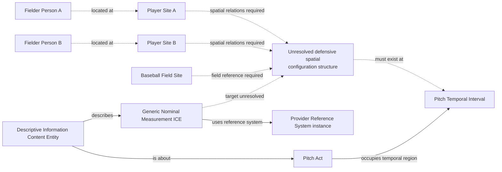
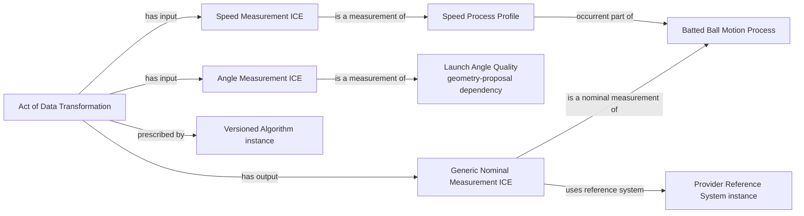
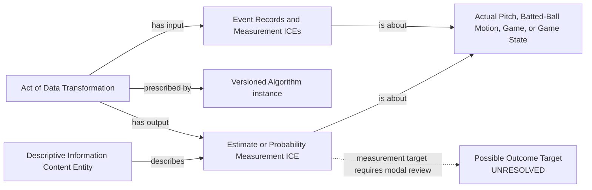
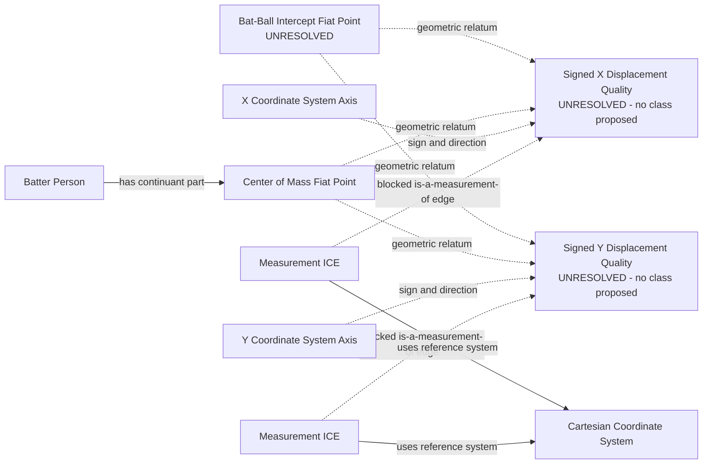

# Source-independent Mermaid

Status: **review only**

Every solid edge below names an existing BFO or CCO relation. Dotted edges are
explicitly unresolved conceptual dependencies and are not object-property
proposals. Source field names appear only in explanatory text, never as world
classes. Solid value, unit, and reference-system edges still depend on prior
acceptance of `ice-direct-values-and-units`; their property IRIs exist now, but
their pinned IBE domains are part of that separate repair.

## 1. Record, measurement, and reality remain distinct

A numerical literal belongs to the ICE. It does not turn the record, pitch,
ball, bat, or player into the measured quality.

## 2. Arm-angle geometry

The anatomical landmark and the tracked Fiat Point of the Baseball remain
ontology-review questions. No `ArmAngle` ICE is proposed as a substitute for
the two Fiat Lines, their shared Fiat Point, or the Angle Quality.

## 3. Sweet-spot motion, attack geometry, and swing-path tilt

Attack angle uses a vertical motion direction and ground reference. Attack
direction uses a horizontal motion direction and home-to-center-field
reference. In each case the reference Fiat Line is constructed through the
tracked sweet-spot Fiat Point at the evaluation Temporal Instant, so it and the
tangent have the shared Fiat Point required by the Angle Quality proposal.
Swing-path tilt additionally requires a reviewed construction of a plane or
canonical line from the last 40 milliseconds of the motion profile. The source
evidence does not justify that construction yet.

The pinned BFO defines a Process Profile intensionally but exposes no accepted
relation that connects this proposed profile to the profiled Swing, the Fiat
Point, and the change in that point's Location. The former class and
`occurrent part of Swing Act` restriction did not supply that differentia and
are removed. The dashed profile node is an ontology gap; it does not authorize
RML or a replacement object property.

## 4. Defensive configuration and nominal alignment

Provider category symbols may classify an actual configuration, but the
current proposal does not model the player Sites, relative spatial relations,
or configuration identity criterion. The former Relational Quality class is
removed. The symbols are not classes of players, pitches, or field sites, and
their nominal ICEs remain blocked until the world-side target is expressible.

## 5. Barrel as a derived nominal classification

Barrel is one symbol under the classification reference system. The RDF must
not assert a `BarrelProcess` or duplicate the launch measurements from
Statcast.

## 6. Analytical estimates and probabilities

This pattern covers xBA, xwOBA, run expectancy, and win expectancy without
asserting a provider score as a physical quality. xBA and home win expectancy
remain blocked until the measured possible process or process aggregate is
accepted.

## 7. Signed intercept components remain blocked

The field names imply subtraction while the CSV prose says distance. Actual
values and official coordinate conventions must resolve that conflict before
an ontology class or measurement mapping is proposed.
