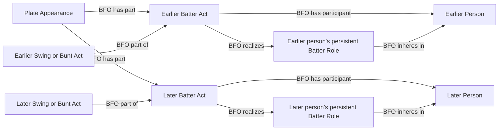

# Question 4: actual batting participation within one PA

The user answered **"Yes, separate"** to question 4, published in `b4d4f88`:
one PA can contain separate existing Batter Acts, one for each person's
uninterrupted participation, with their actual actions and persistent Batter
Role. Official statistical PA assignment is separate. This record fixes the
engineering scope of that existing acceptance before implementation; it does
not introduce a new approval, term, property or statistical assignment pattern.

## Competency questions and accepted graph constraints

1. Can two people actually bat during one PA? Yes: each supported uninterrupted
   participation has its own Batter Act, participant and realized Batter Role.
2. Does the final matchup batter own earlier swings? No: an actual swing or
   bunt belongs to the particular Batter Act and same person's persistent role.
3. Does a replaced player who never started this PA get a participation act?
   No act is inferred merely from replacement in the lineup before any batting.
4. Do these acts count as two official statistical PAs? No. The source/graph
   official-credit reconciliation remains separate and must reject ambiguity.
5. What happens if the substitution chain or pitch assignment conflicts?
   Fail source preparation; never promote the final batter as every actor.

The source SHACL profile must allow multiple contained Batter Acts, require
one person and that person's role for each, and require every swing/bunt to
agree with its enclosing Batter Act's person, role and PA. Source membership
serialization must match the selected participation and action identities.

## Source evidence and selection inventory

Immutable `data/raw/samples/2026-07-18/824169.json`, SHA-256
`977175eabf976564953f859ad4f342b249d3c0c0aacbae1f8b41d65c5e3cac75`,
PA 31: Christian Walker (572233) swings at pitch
`7febb4e5-9fa3-3a27-a086-d8dcf22a4742`. After an injury delay, event 3 explicitly
substitutes LaMonte Wade Jr. (664774) for Walker. Wade swings at subsequent
pitches and reaches on an error. Final matchup identifies Wade. Full source
membership mechanically reconciles. Substitution and neighboring pitch bounds
agree; the administrative timeout does not supply exact participation bounds.

| Field | Selection | Use |
| --- | --- | --- |
| `gamePk`, `about.atBatIndex` | Identity/join-only | Existing game/PA scope |
| `matchup.batter.id` | Identity/join-only | Final batter; chain reconciliation |
| `playEvents[].details.eventType`, `isSubstitution`, `position.abbreviation` | Already supplied | Explicit PH changes; distinguish PR changes |
| `playEvents[].player.id`, `replacedPlayer.id` | Identity/join-only | Incoming/outgoing persons |
| `playEvents[].index`, `playId`, `isPitch` | Identity/join-only | Complete membership and distinct actual pitches |
| `playEvents[].startTime`, `endTime` | Already supplied | Corroborate assignment across substitution, without exact Batter Act duration |
| `playEvents[].details.call.code` | Already supplied | Existing swing/bunt mapping, with corrected actual batter |
| Boxscore official PA totals | Already supplied | Existing independent official-credit gate; not two PAs per substitution |
| Per-person uninterrupted participation and assigned pitches | Deterministically derivable | Accepted Q4 identity with complete explicit substitution chain |

## Source-independent shape

Keep the existing single-participant IRI for ordinary PAs. When multiple
actual batters are evidenced, serialize the accepted PA/person participation
with a person suffix. This bounded MLB projection rejects re-entry or repeated
person stints rather than conflating them. It does not assert precedence
between whole Batter Acts or create exact intervals from source rows.

RML and source SHACL stay in `mlb-game`; no topology or global ratification
changes. Exact scoped runtime pins may follow this accepted implementation.
