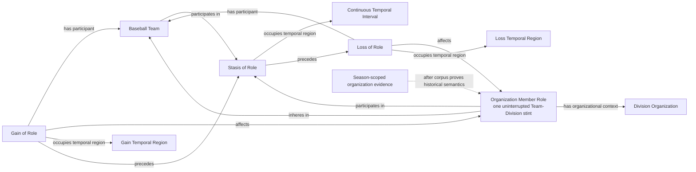

# Source-independent Mermaid

Status: **under review - design only**

The Team is not a continuant part of the Division. The organizations lane may
create this history only from its own season-scoped corpus after the known
historical-change tests pass. The first observation may be left-censored and
does not invent a Gain. An explicit change to another Division supports Loss
of the old Role and Gain of a new Role at the precision actually supplied.
Missing observations do not end a Role. Stasis never realizes it.

