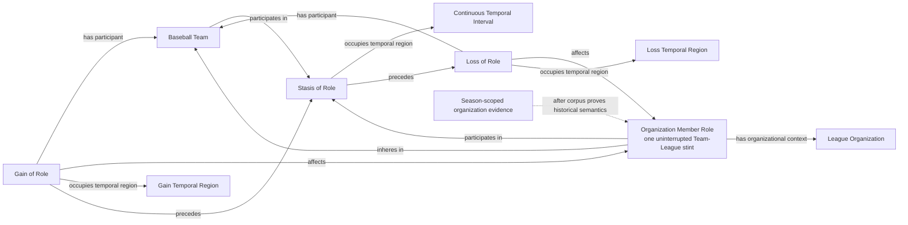

# Source-independent Mermaid

Status: **under review - design only**

League membership is asserted independently of Division membership and never
through aggregate parthood. The first observation may be left-censored. A
supported League change ends the old Member Role and begins a new one; a later
return creates another Role individual. Missing observations do not end a
Role, and Stasis never realizes it.

