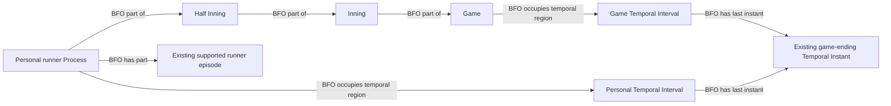

# Question 8: the supported walk-off boundary

The user accepted question 8 in `b4d4f88`: evaluate at the supported official
game-ending boundary, retain only counted advances/outs and add no erosion
merely because the game ended. This records the engineering scope of that
existing acceptance before implementation, not a new semantic approval.

The existing C1 personal runner Process ends at its supported terminal scope.
For a still-active runner when the game ends, reuse the already represented
game-ending Temporal Instant as the last instant of the personal Process's
Temporal Interval. Keep its observed episodes, person and Half Inning. Do not
create an Out Process, score, further advance, location, stasis or exact motion
duration. The game-ending boundary is distinct from a third-out stranding.

## Competency questions

1. Must a supported walk-off half contain a third out? No. Reconcile the
   actual outs and final counted runs, and use the supported game boundary.
2. What happens to runners still active then? Close their C1 scope at the
   existing game endpoint, retaining only supported prior episodes.
3. Does game ending imply erosion? No. Actual outs remain distinct and the
   game-end fact itself adds no out or loss of opportunity.
4. May source order or Final alone establish a complete history? No. Existing
   full source/half reconciliation, source time bounds, identities, operative
   outcomes and substitution/review gates still apply.

SHACL must require any such personal-interval endpoint to identify the same
game's typed, timestamp-supported endpoint, prevent conflicting endpoints and
prevent a game-ended active history from also acquiring a counted Out/Run.

## Field inventory and evidence

| Existing field | Selection | Use |
| --- | --- | --- |
| `gamePk`, `metaData.timeStamp` | Identity/join-only | Existing game and revision |
| `gameData.status`, existing final/game-over flags | Already supplied | Corroborate an actually ended game |
| `linescore.scheduledInnings`, final inning/half | Already supplied | Bound this extension to final bottom regulation/extra innings |
| Final and preceding `result` scores; linescore team totals | Already supplied | Independently reconciled winning score transition |
| Full events and runner membership, `isScoringEvent`, outs | Already supplied | Counted effects; require one supported terminal event anchor |
| Final baseball play `about.endTime` | Already supplied | Reuse the accepted game endpoint, not arbitrary runner motion times |
| C1 interval ending at that game boundary | Deterministically derivable | Accepted Q8 boundary within the existing C1 scope |

Immutable `data/raw/samples/2026-07-20/824087.json`, SHA-256
`249a1df5bb53bc0e5fac2ba16f2204029e7d6325229824523e7fccc85779f237`:
PA 72 ends a ninth-inning walk-off bunt with one actual out in the half.
Josh Rojas scores; Tyler Tolbert has a supported second-base outcome and Nick
Loftin a supported first-base outcome. Terminal source event
`ccc18a37-bb05-3485-94d6-7d80bada52b6` ends at
`2026-07-21T02:10:40.603Z`. Existing reconciliation withholds this half solely
for its missing third-out termination, not missing movement evidence.

The home-run counterexample is `data/raw/samples/2026-07-18/824412.json`,
SHA-256 `1fcfc57c7d7c294190852e0c5a2be35926c225606b7d5981320ae11a749d38eb`.
Retain both counted scoring histories, including the batter's; do not stop
counting source-supported home-run scoring at the first winning run.

Rule 7.01(e)(3) distinguishes ordinary winning-run termination from the
out-of-park home-run exception. The mapping uses final counted evidence and
the accepted game endpoint, rather than guessing completion from play order.
[MLB 2026 Official Baseball Rules, printed page 94](https://mktg.mlbstatic.com/mlb/official-information/2026-official-baseball-rules.pdf#page=106).

## Source-independent shape

The source module remains `mlb-game`; no source, vocabulary or topology is
added. Scoped runtime pins follow this already accepted question 8. Extra
inning placed-runner entry, unresolved reviews and substitutions remain their
own prerequisites; a walk-off does not bypass them.
