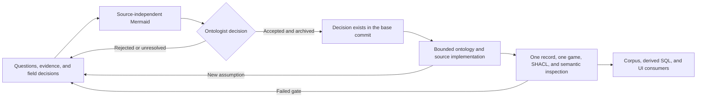

# BaseballO semantic governance

This directory records how BaseballO separates ontologist review from semantic
implementation. It exists because syntactically valid RDF, passing SHACL, and
successful ingestion did not prevent an unreviewed Statcast model from reaching
the ontology, RDF generation, SPARQL, SQL, and the Explorer.

The project owner, Carter Beau Benson, is the BaseballO ontologist. Automation
may collect evidence, draft proposals, implement an accepted design, and check
conformance. It may not make or infer the ontologist's decision.

## Current semantic state: approved modules inside a frozen baseline

The repository-wide semantic baseline remains **frozen and unratified** as
recorded in [`semantic-freeze.json`](semantic-freeze.json). That global status
prevents the presence of accepted source work from being misread as blanket
ratification of every protected ontology, identity, context, reasoning, and
query artifact. New meaning still requires the lifecycle below; a passing
transform or operational request is never semantic approval.

Within that boundary, the exact executable contracts for the seven registered
MLB source modules are semantically **approved** and operationally **active**.
Their RML, source SHACL, context, and identity surfaces are pinned against
unreviewed extension. Their named accepted decisions do not silently ratify
unrelated protected artifacts or unresolved ontology debt.

The MLB-game audit originally recorded thirteen blockers. The ontologist
accepted the corrected pinned RML contract on 2026-08-31, and the audit now
retains those findings as historical curation evidence rather than current
blockers. The accepted Teams, Leagues, Divisions, People, Venues, and
Transactions contracts went through the same proposal-before-implementation
boundary.

These distinctions are deliberate:

- **approved** identifies an exact module surface accepted by the ontologist;
- **frozen and unratified** prevents those bounded decisions from becoming
  blanket acceptance of the repository's full semantic baseline;
- **operational** authorizes a pinned source lane to run but does not authorize
  adjacent semantic expansion.

See [the 2026-08-28 recent-work audit](RECENT-WORK-AUDIT-2026-08-28.md) for the
historical failure analysis and the
[MLB game semantic audit](../sources/mlb-game/SEMANTIC-AUDIT.md) for the
accepted 2026-08-31 disposition.

## Proposal before implementation

Semantic work is published in separate review and implementation phases. They
must not be collapsed into one commit or treated as one uninterrupted task.

### Phase 1: evidence and design only

Create one package under [`../proposals/`](../proposals/) containing:

1. competency questions;
2. source evidence, including positive and nearby negative or ambiguous cases;
3. a field-level duplicate, derivative, join-only, additional, or unresolved
   inventory;
4. source-independent Mermaid showing world-side entities before ICEs;
5. identity, unit, missing-value, correction, and provenance decisions;
6. ontology gaps and proposed vocabulary, axioms, and annotations; and
7. a `review.json` copied from
   [`templates/proposal-review.json`](templates/proposal-review.json).

Each artifact entry in `review.json` is an exact `{path, sha256}` object. The
hash uses the repository's canonical UTF-8/LF text form, so review evidence is
stable across Windows and Linux checkouts. Moving an accepted package does not
permit its Mermaid, inventory, questions, or source evidence to change later.

During this phase, `review.json` is `draft` or `under-review`. No proposed IRI
or pattern may appear in executable ontology, context builders, RML, SHACL,
SPARQL contracts, reasoning profiles, authoritative RDF, serving schemas, or UI
code.

### Phase 2: ontologist disposition

The ontologist explicitly accepts or rejects the named proposal and its stated
scope. The decision is recorded in `review.json`, including who decided, the
date, and the rationale. Validation success, an instruction to keep working, an
unusually fast transform, or lack of objection is not acceptance.

Accepted and rejected packages move to
[`../archive/design-records/`](../archive/design-records/) with their
disposition. An accepted record authorizes only its listed IRIs and artifacts.
A rejected package licenses no implementation and must not be copied as a
starting point for later work.

For an accepted record, `ontologistDecision.authorizedArtifacts` names the
protected Baseball-root-relative files that a later implementation may change.
`proposedIris` names the exact new or revised vocabulary in scope. Neither list
is an invitation to make adjacent cleanup changes.

### Phase 3: bounded implementation

Implementation starts in a later change from the accepted archived record. It
must:

1. cite the accepted review record and preserve its exact scope;
2. implement only accepted classes, axioms, identity rules, and relations;
3. create source-specific Mermaid and executable RML/SHACL inside one detachable
   source module;
4. prove one representative record, then one complete game;
5. pass SHACL and human semantic inspection against the accepted
   source-independent design;
6. record positive and negative fixture evidence; and
7. stop if implementation reveals an assumption not covered by the decision.

An uncovered assumption returns to Phase 1. It is not resolved by broadening a
class, embedding meaning in an ICE, inventing a literal, or weakening a shape.

### Phase 4: promotion and consumers

Bounded corpus promotion follows the accepted one-game proof. Cross-source
SPARQL, analytical SQL materialization, and UI exposure follow only after the
promoted RDF and query equivalence have been reviewed. Derived stores must be
rebuilt after any authoritative semantic correction.

## Review records are evidence, not self-approval

The review template is intentionally machine-readable so repository checks can
distinguish a draft from an accepted archived decision. An agent may prepare a
draft or record an explicit decision already made by the ontologist. It must
never fill an acceptance record on the ontologist's behalf or treat its own
rationale as approval.

Active proposal packages may contain only `draft` or `under-review` records.
Only an archived `accepted` record may authorize a later executable semantic
change. The accepted record and every hash-pinned review artifact must be
present in the comparison base before the implementation change, preserving
the proposal-before-implementation order.

## Infrastructure is not automatically semantic approval

Acquisition, retry handling, atomic promotion, provenance, storage, query
benchmarking, and SQL integrity controls can remain useful even when an
upstream semantic model is blocked. They may continue when a change does not
alter modeled meaning or admit unreviewed facts.

Conversely, moving a computation from SPARQL to SQL does not repair its input
semantics. A serving route may be technically sound while its derived rows need
to be quarantined, qualified, or rebuilt after an RDF correction.

## Ownership and enforcement

[`../../.github/CODEOWNERS`](../../.github/CODEOWNERS) assigns repository
review to `@CarterBeauBenson`. CODEOWNERS becomes an enforcement boundary only
when the Git hosting rules require Code Owner review and prevent bypassing the
protected branch; the file alone does not block a direct push.

Repository instructions and automated validation provide additional controls,
but neither can decide realism, identity, evidence sufficiency, or an
Aristotelian definition. Those remain ontologist decisions.
