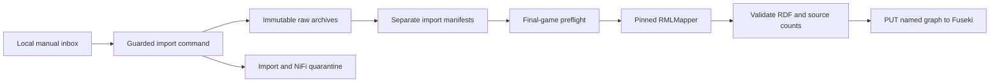

# NiFi flow boundary

The active manual game flow implements this contract:



The response body remains the exact supplied payload. Routing metadata such as `gamePk`, import time, source filename, and checksum belongs in FlowFile attributes and import manifests—not in rewritten JSON.

NiFi is an orchestrator here, not a semantic modeler. It must not write to or modify `ontology/BaseballO.ttl`. Only validated RDF generated by the approved RML mapping may reach Fuseki.

The initial process group will use these parameters rather than machine-specific paths embedded in processors:

| Parameter | Local development value |
| --- | --- |
| `baseballo.pipeline.root` | `%LOCALAPPDATA%\BaseballO\state\pipeline` |
| `baseballo.fuseki.base` | `http://127.0.0.1:3030` |
| `baseballo.fuseki.dataset` | `baseball-dev` |
| `baseballo.fuseki.graph-store` | `http://127.0.0.1:3030/baseball-dev/data` |

Secrets do not belong in the flow definition or these tracked files.

Create or repair the initial process-group hierarchy through NiFi's authenticated local API:

```powershell
.\scripts\infra\configure-nifi-foundation.ps1
```

The command is idempotent. It creates missing groups but does not replace, delete, start, or stop existing flow components.

Create the visual processor skeleton inside `90 Shared RDF Mapping and Load` with:

```powershell
.\scripts\infra\configure-nifi-rdf-skeleton.ps1
```

This command adds five deliberately stopped, unconnected processors representing the shared semantic boundary. They remain a visual decomposition of the internal guarded command.

The `01 Games - Manual Inbox` group contains the executable local-only flow. Configure and enable it with:

```powershell
.\scripts\infra\configure-nifi-games-manual.ps1 -Enable
```

The idempotent command creates a local inbox reader, collision-safe staging handoff, guarded importer, successful-run logging, and failed-output persistence. It does not contain an external HTTP processor. Use the [pipeline runbook](../../scripts/pipeline/README.md) to submit data.

For repeatable bulk processing, `submit-game-corpus-to-nifi.ps1` is the corpus
producer and monitor. NiFi remains the orchestrator for every game. The manual
flow defaults to three concurrent guarded imports; pass `-ConcurrentImports`
to the configuration or submission command to tune that bounded concurrency.

The earlier `01 Games - Daily` network-acquisition group is deliberately stopped. Its design is retained for later review, but it is not part of the active pipeline.
The checked-in 2026-07-14 through 2026-08-06 corpus is processed locally and
does not require this group. Explicitly approved command-line acquisition does
not authorize enabling an unattended NiFi network flow.

## Repeatable validation and evidence

The `91 Repeatable Validation and Evidence` group is the first post-import
orchestration slice. Its seven stage processors cover direct-mapping and SHACL
checks, selective reasoning, canned and advanced SPARQL audits,
authoritative/index equivalence, disposable benchmark generation, and the full
offline repository gate.

The authoritative stage definitions are versioned in
[`repeatable-stages.json`](repeatable-stages.json). The NiFi processors contain
only stage identifiers, schedules, and the shared runner invocation; query
text, mappings, shapes, reasoning profiles, baselines, and commands remain
reviewable repository artifacts.

Configure the stopped flow after the foundation exists:

```powershell
.\scripts\infra\configure-nifi-evidence.ps1
```

Enable only stages whose runtime boundary is available. For example, the full
offline gate does not require Fuseki:

```powershell
.\scripts\infra\configure-nifi-evidence.ps1 `
  -EnableStage repository-validation
```

The four corpus query and benchmark stages require loopback Fuseki with the
accepted eight-game graphs and current local build manifests. They deliberately
disable fingerprint skipping because the dataset is mutable external state.
Offline stages skip an unchanged dependency fingerprint unless explicitly run
through the shared runner with `--force`.

Every invocation writes a compact manifest under
`state\pipeline\evidence\nifi\<stage>\runs`. Successful evidence is also copied
to `latest-success.json`. A failed command returns a nonzero status to NiFi and
copies its manifest and complete log to
`state\pipeline\quarantine\nifi-evidence\<stage>\<run-id>`. Benchmark artifacts
are generated below local state rather than overwriting reviewed repository
baselines.
