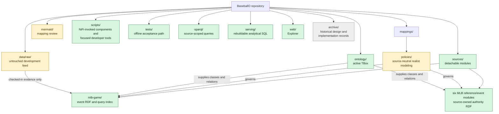

# Pipeline and Repository

## Active data flow

```mermaid
flowchart LR
    SOURCE["Independent MLB API<br/>connectors"] --> LANES["Seven detachable<br/>NiFi source lanes"]
    LANES --> STAGE["Byte-identical<br/>transient staging"]
    STAGE --> CTX["Disposable execution context<br/>source bytes unchanged"]
    CTX --> RML["Source-owned RML"]
    RML --> SHACL["Source-owned SHACL"]
    SHACL --> FUSEKI["Persistent authoritative RDF<br/>Jena Fuseki / TDB2"]
    FUSEKI --> INDEX["Game-only rebuildable<br/>indexed RDF"]
    FUSEKI --> QUERY["Approved post-promotion<br/>or batch SPARQL"]
    INDEX --> QUERY
    QUERY --> SQL["Persistent derived<br/>analytical serving"]
    SQL --> SITE["Explorer interface"]
    FUSEKI --> LIVE["Live SPARQL<br/>novel research"]
    LIVE --> SITE

    ENRICH["No source rewriting<br/>No flattening<br/>No normalization"] -. prohibited .-> RML

    classDef active fill:#d7f5df,stroke:#24733b,color:#102a18;
    classDef prohibited fill:#fde2e2,stroke:#a33,color:#4a1111;
    class SOURCE,LANES,STAGE,CTX,RML,SHACL,FUSEKI,INDEX,QUERY,SQL,LIVE,SITE active;
    class ENRICH prohibited;
```

## Repository roles

```mermaid
flowchart TB
    ROOT["BaseballO repository"]
    ROOT --> ONT["ontology/<br/>active TBox"]
    ROOT --> SOURCES["sources/<br/>detachable modules"]
    SOURCES --> MLB["mlb-game/<br/>event RDF and query index"]
    SOURCES --> REF["six MLB reference/event modules<br/>source-owned authority RDF"]
    ROOT --> MAP["mappings/"]
    MAP --> POLICY["policies/<br/>source-neutral realist modeling"]
    ROOT --> MERMAID["mermaid/<br/>mapping review"]
    ROOT --> DATA["data/raw/<br/>untouched development feed"]
    ROOT --> SCRIPTS["scripts/<br/>NiFi-invoked components and<br/>focused developer tools"]
    ROOT --> TESTS["tests/<br/>offline acceptance path"]
    ROOT --> SPARQL["sparql/<br/>source-scoped queries"]
    ROOT --> SERVING["serving/<br/>rebuildable analytical SQL"]
    ROOT --> WEB["web/<br/>Explorer"]
    ROOT --> ARCHIVE["archive/<br/>historical design and<br/>implementation records"]

    POLICY -->|"governs"| MLB
    POLICY -->|"governs"| REF
    ONT -->|"supplies classes and relations"| MLB
    ONT -->|"supplies classes and relations"| REF
    DATA -->|"checked-in evidence only"| MLB

    classDef active fill:#d7f5df,stroke:#24733b,color:#102a18;
    classDef reference fill:#fff2cc,stroke:#997a00,color:#3d3100;
    classDef archive fill:#eeeeee,stroke:#777,color:#333;
    class ONT,SOURCES,MLB,REF,SCRIPTS,TESTS,SPARQL,SERVING,WEB active;
    class POLICY,MERMAID,DATA reference;
    class ARCHIVE archive;
```

The archived Stage 1 prototype is intentionally outside the active path because it enriches the input before mapping.
